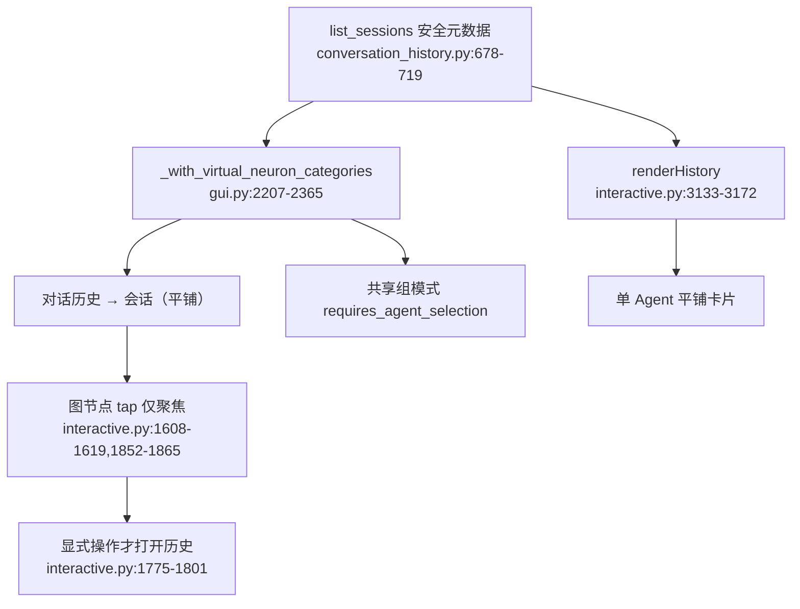
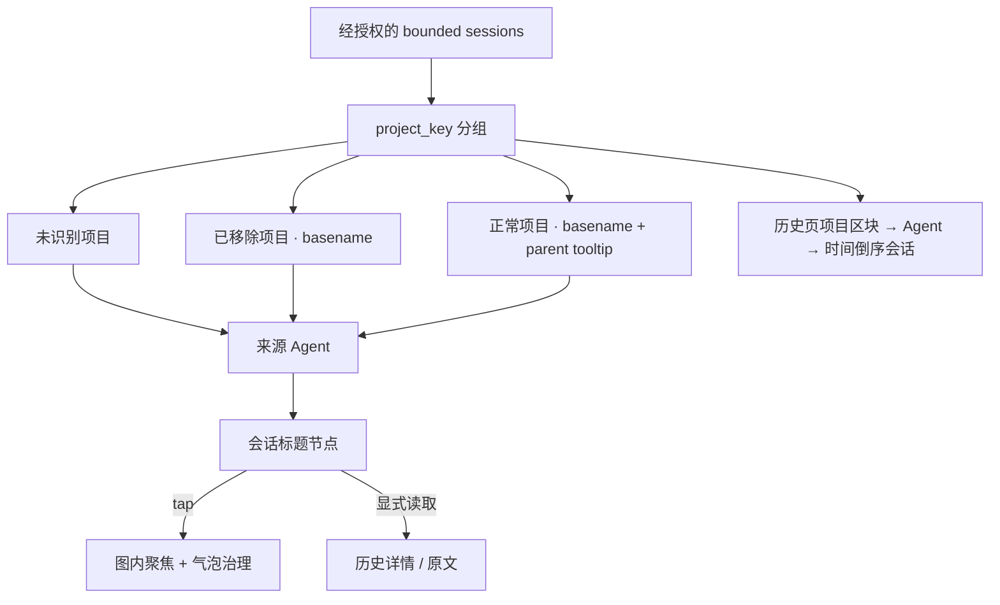

# Feature C：神经图与历史页项目化投影

## 当前流程

## 当前缺口

- 共享组图不聚合历史，计数为零。
- 历史根节点直接挂会话，没有项目与来源 Agent 层。
- 历史页要求先选 Agent，卡片平铺。
- 旧导入缺少项目身份，大量会话只能进入 unknown bucket。
- 现有点击留在神经图的交互是正确基线，应保留。

## 目标流程

## 数据契约

- `project_groups[]`：`project_key`、canonical `project_ref`、label、path status、session count、agents、latest time。
- session 安全元数据：owner Agent、provider、project key/ref、title/summary、时间、turn count。
- 图节点 ID 使用 canonical project hash，不使用 basename。
- 图节点禁止携带 raw content、长期记忆正文或 `memory_id`。
- 全局分页必须确定性；每组显示真实 count 与 `has_more`。

## 验收

- 共享组图展示 `对话历史 → 项目 → Agent → 会话`。
- 点击各层节点不自动跳页，显式“读取原文”才进入详情。
- 同名项目通过父路径/tooltip 可辨识。
- 项目目录删除后会话仍存在并标记“已移除”。
- 标题为空时用 provider、时间、首个用户消息生成稳定标题，不显示大批“未命名会话”。

置信度：高。分页产品策略采用全局 bounded 查询加每组精确计数。
