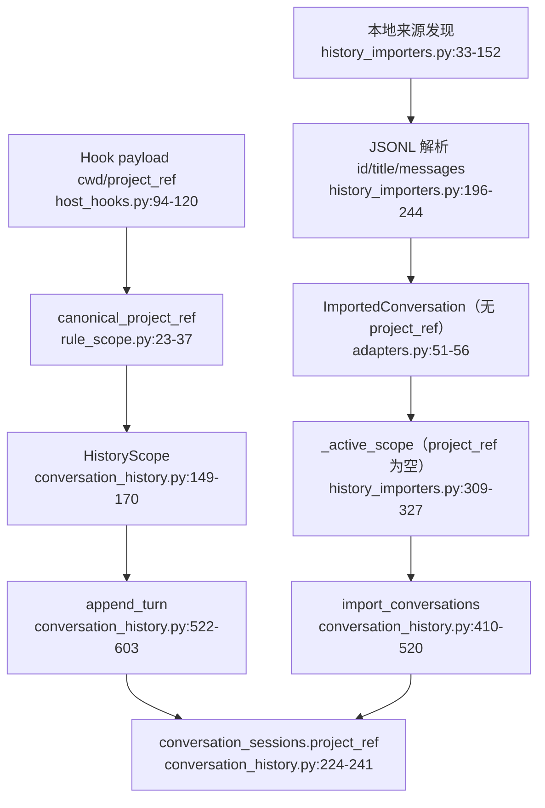
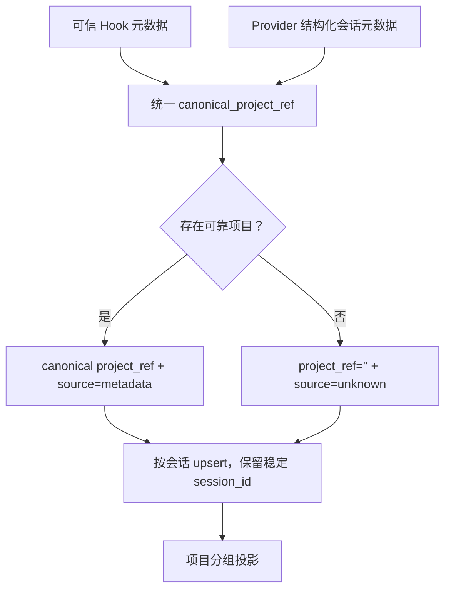

# Feature A：对话历史项目身份

## 当前流程

## 结论

- 实时 Hook 已能从可信 `cwd/project_ref` 记录项目。
- 旧会话回填丢失项目身份：解析器不读取项目元数据，`ImportedConversation` 也无对应字段。
- `rule_scope.canonical_project_ref` 与 `conversation_history._normalize_project_ref` 重复且规范不同，可能被大小写和斜杠别名拆成两个项目。
- Codex 日期树不能当项目；缺少可信元数据时必须归入“未识别项目”。
- 项目身份必须逐会话携带，不能用一个批次级 scope 覆盖整个文件。
- 旧 session ID、turn ID、evidence link 必须稳定；补录项目身份不得重建会话。

## 目标流程

## 验收

- Windows 大小写、反斜杠和正斜杠别名合并为同一项目。
- 同名不同完整路径保持分离。
- Codex/Claude/Cursor 元数据中的 `cwd/project_ref` 可逐会话导入。
- 无元数据不从标题或正文猜测，稳定显示“未识别项目”。
- 旧空项目记录仍可查；受控补录不破坏 turn/evidence。

置信度：高。Provider 不同版本的项目元数据字段需要兼容性 fixture。
