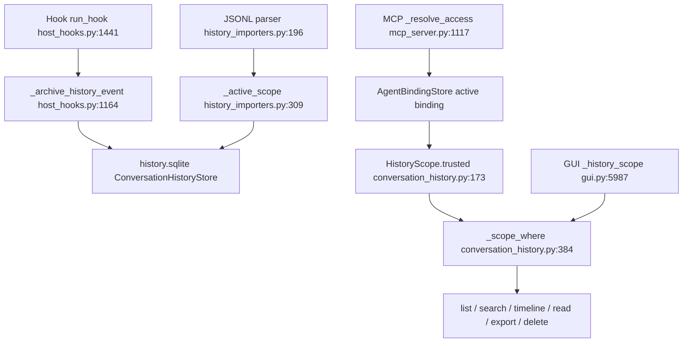
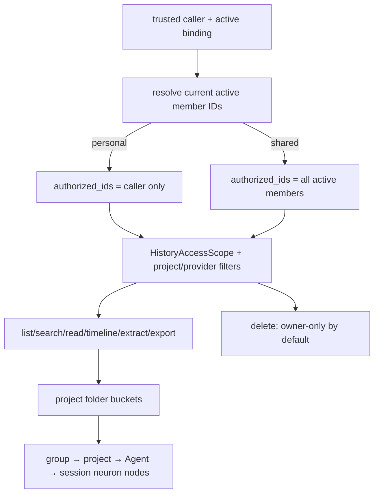

# 共享组对话历史授权与动态查询

## 边界与现状

- 原始会话单独落在 `history.sqlite`，不会写入 SharedMemoryRecord/bootstrap。
- Hook 路径从宿主事件携带 `agent_instance_id`、`share_group_id`、`project_ref/cwd`，写入 raw history；本地 JSONL 回填目前只绑定 provider/Agent，未抽取项目目录。
- `share_group_id` 当前是 `HistoryScope` 的 metadata 与 SQL 过滤条件，不是授权边界；所有查询仍以一个 `agent_instance_id` 精确匹配。
- MCP 顶层 group 由 active binding 派生；嵌套 `scope.share_group_id` 没有与 trusted binding 比对。GUI scope 只做语法校验，history API 不检查 active membership。

## 精确来源

| 责任 | 来源 |
| --- | --- |
| Agent 绑定/成员 | `src/memoryguard/agent_binding.py:84-137,182-229` |
| trusted MCP 身份 | `src/memoryguard/access_context.py:18-64`; `src/memoryguard/mcp_server.py:1048-1150` |
| Hook raw 归档 | `src/memoryguard/host_hooks.py:353-371,1164-1236,1441-1486` |
| 回填 scope/解析 | `src/memoryguard/history_importers.py:196-244,309-327,382-400` |
| HistoryScope/SQL 授权 | `src/memoryguard/conversation_history.py:149-181,384-398` |
| list/search/read/export/delete | `src/memoryguard/conversation_history.py:678-849` |
| MCP history 入口 | `src/memoryguard/history_api.py:14-32`; `src/memoryguard/mcp_server.py:1624-1670` |
| GUI scope/history | `src/memoryguard/governance_scope.py:76-164`; `src/memoryguard/gui.py:961-975,5987-6044` |
| 当前神经图 overlay | `src/memoryguard/gui.py:2318-2365` |

## 现状流程

## 目标流程

## 授权与操作差异

| 场景 | 当前行为 | 目标行为 |
| --- | --- | --- |
| personal | `agent_instance_id = caller` | 保持精确 owner；永不看到 sibling |
| shared list/search/read/timeline/extract/export | 仍只返回 caller rows | 当前 active member IDs 动态聚合；返回 owner Agent 元数据 |
| shared delete | 当前按 caller rows；未来 fan-out 若直接复用会越权 | 只允许 owner 删除；跨 owner 需管理员显式路径 |
| MCP nested group | 任意 nested group 可作为 SQL filter | 服务端覆盖/比对为 trusted binding group；不匹配 fail-closed |
| GUI share group | syntactic scope，可直接传任意 group；神经图要求选 Agent | history API 统一 active membership resolver；共享图直接加载聚合结果 |
| 离组 | binding inactive，历史仍留库但查询没有动态成员语义 | 查询按当前 active members；离组立即失去 group 可见性，不复制、不删除数据 |

## 关键风险与重复点

1. **授权重复/分叉**：MCP `_resolve_access`、`HistoryScope.trusted`、GUI `_parse_scope` 各自处理 scope；后续 fan-out 若只改 Store，会绕过 MCP/GUI 的成员校验。
2. **伪造入口**：`HistoryScope.trusted()` 只校验 `scope.agent_instance_id`，未校验 `scope.share_group_id`；`GovernanceApi._history_scope()` 直接构造 scope。必须统一生成服务端不可伪造的 `authorized_agent_ids`。
3. **存量归属语义**：session 行只存 owner agent 与写入时 group；动态聚合若仅按当前 group 字段会漏掉加入前会话。产品需明确“共享组是否能看到成员加入前历史”；推荐按 active owner IDs 聚合，保留 lineage/audit 元数据。
4. **删除副作用**：delete 会永久删除 session/turn，并原子 invalid evidence；共享列表中的兄弟会话不能暴露为可删除。
5. **项目身份缺失**：JSONL import 未读取 cwd/project_ref，无法可靠生成项目桶；只能标记“未识别项目”，不得按文件名猜项目。

## 测试覆盖

现有测试只证明单 Agent 隔离、trusted agent 与 delete confirmation：

- `tests/test_conversation_history.py:25-40,74-107`
- `tests/test_history_runtime_integration.py:27-52,54-85,103-115`

缺口应补：

1. 同组 a1/a2 各写会话；shared list/search/read/export 对两者均可见，返回 owner id/display。
2. outsider、不活跃 binding、不存在 group、跨组 claimed group 均 fail-closed。
3. a1 离组后，group 查询立即排除 a1；历史数据仍在个人/原库，未物理复制。
4. personal scope 永不返回 sibling；shared delete sibling 拒绝，owner delete 保持 evidence tombstone。
5. nested `scope.share_group_id` 与 trusted group 不一致必须拒绝或由服务端覆盖；顶层 group 也不能改变 binding。
6. project_ref canonical 化、同 basename 不合并；group/project/session 计数与分页 total 一致。
7. resolver 与查询之间发生 unbind 时，使用请求内 active-member 快照并记录授权版本，避免半请求越权。

**置信度：0.95（代码路径、SQL、现有测试均有精确引用）；0.75（加入共享组前的个人历史是否立即共享，需产品决策）。**

