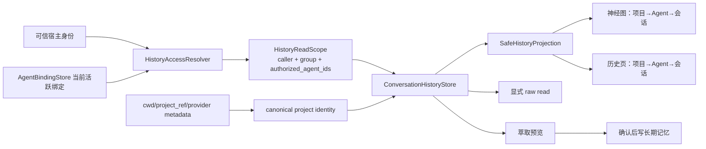

# 统一架构提案

## 核心模型

## 1. 权限模型

- 写 scope 始终有一个 owner Agent。
- 读 scope 是服务端生成的不可伪造结构：
  - personal：`authorized_agent_ids=(caller,)`
  - shared：调用者必须是该组当前活跃成员；`authorized_agent_ids` 为当前全部活跃成员。
- 每次请求动态解析；不缓存跨请求成员列表，不复制历史。
- stored `share_group_id` 是来源元数据，不作为唯一授权条件。这样 Agent 加入共享组后，其既有会话也可被当前成员查询；离组后立即不可见。
- 请求中的 group 只能与可信 binding 一致，不能改变授权组。
- list/search/timeline/read/extract/export 可共享；delete 只限 owner，跨 owner 需要明确本地 admin capability。

## 2. 项目身份

- 文件系统 ref 全部走唯一 canonical helper。
- `ImportedConversation` 增加逐会话 `project_ref` 与可选 source/confidence。
- 优先结构化 metadata：`project_ref`、`cwd`、provider 明确字段。
- 缺失时保存空 ref，展示“未识别项目”；不读取正文猜测。
- session ID 不因后续 canonical 补录而改变；项目更新是原行迁移。
- 新增 shared-query 组合索引，保留现有 owner/project/provider 索引。

## 3. 安全投影

Store/API 返回：

- `project_groups`：stable key、label、canonical ref、path status、counts、agents、latest time。
- `sessions`：session ID、title/summary、owner Agent、provider、project key/ref、time、turn count。
- 不返回 raw content、长期记忆 body 或 `memory_id`。

图节点：

`virtual-conversation-history → virtual-history-project → virtual-history-agent → history_session`

点击只选择和展开气泡；只有显式读取按钮才调用 raw read。

## 4. 旧数据

- 空 project_ref 继续归入 unknown。
- 扫描原日志的稳定 metadata 可原位补录；无证据不变更。
- 规范化迁移必须保持 session/turn/evidence ID。
- 已删除目录只改变 projection 的 path status，不删除历史。

## 5. 回归矩阵

| 场景 | 预期 |
|---|---|
| personal Agent A/B | 互不可见 |
| A/B 同一 shared group | 双方 list/search/read 可见 |
| A 离组 | A 旧会话不再出现在原组，数据仍存在 |
| outsider 声称 group | fail closed |
| nested scope 伪造 group | fail closed |
| 同 basename 不同路径 | 两个项目节点 |
| 路径别名 | 一个项目节点 |
| 项目目录已删除 | 仍可查，标记 removed |
| unknown old history | 未识别项目 |
| 共享成员删除他人会话 | 拒绝 |
| bootstrap | 不含 raw history |

## 决策

采用“动态成员聚合 + 项目化安全投影”。这满足“对话记忆共享可查”，同时保留 owner、离组撤权、原始内容按需读取三条安全线。
