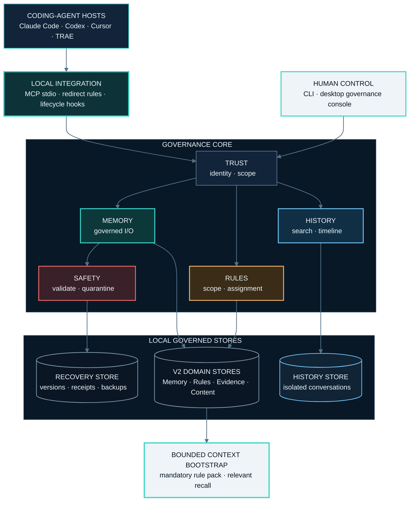
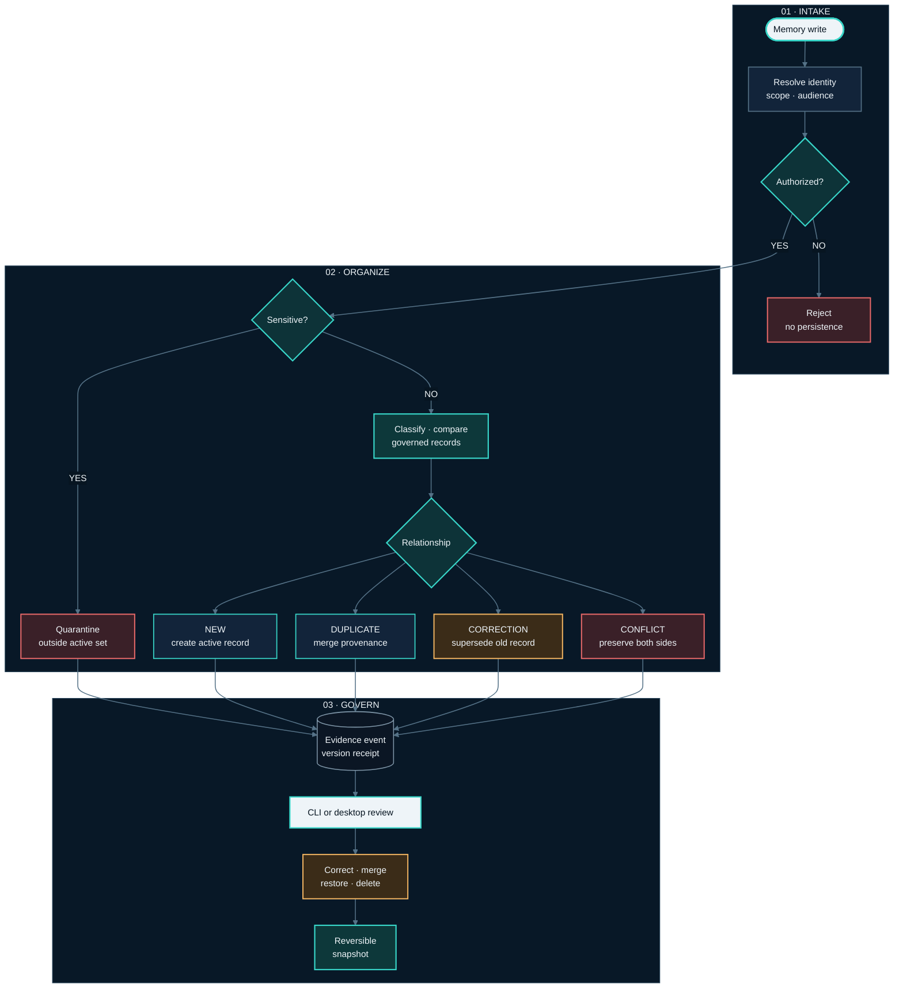
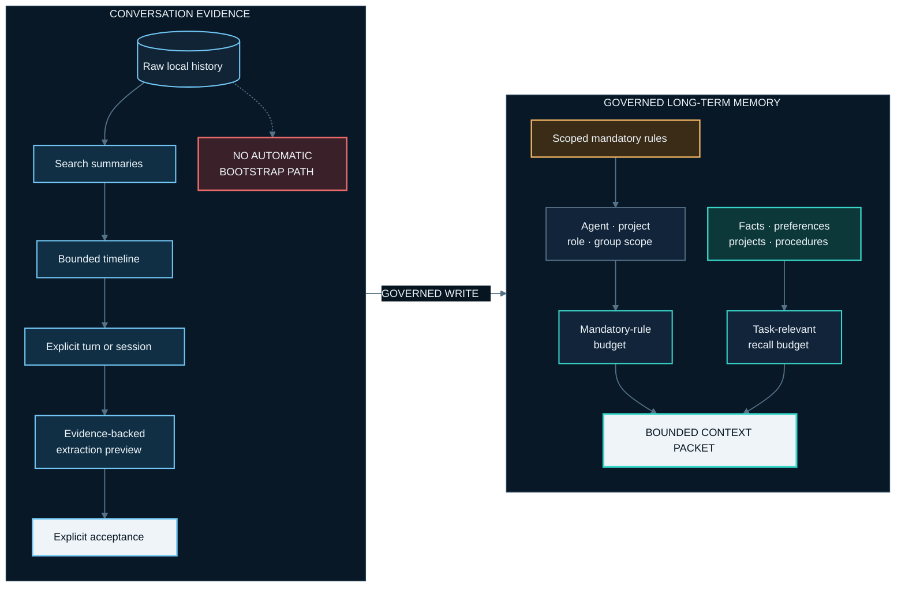

<h1 align="center">MemoryGuard</h1>

<p align="center">
  <strong>Governed shared memory for coding agents.</strong><br />
  Local-first MCP memory with automatic organization, scoped rules, evidence, and rollback.
</p>

<p align="center">
  <a href="https://pypi.org/project/agent-memguard/"></a>
  <a href="https://github.com/irisxc4/memoryguard/actions/workflows/ci.yml"></a>
  <a href="https://github.com/irisxc4/memoryguard/blob/main/pyproject.toml"></a>
  <a href="LICENSE"></a>
  <a href="README.zh-CN.md">中文文档</a>
</p>

> Let agents write without turning shared memory into an unreviewed pile.
> MemoryGuard organizes each write, preserves the evidence behind changes, and
> keeps governance decisions reversible.
>
> **No account. No remote server. No telemetry. Memory stays local.**

<p align="center">
  <a href="#quick-start">Quick start</a> ·
  <a href="#upgrade">Upgrade</a> ·
  <a href="#knowledge-library">Knowledge Library</a> ·
  <a href="#system-architecture">Architecture</a> ·
  <a href="#supported-hosts">Supported hosts</a> ·
  <a href="#privacy-and-safety">Privacy and safety</a>
</p>

<p align="center">
  
</p>

<p align="center">
  <sub>A synthetic governed projection: signals move through memory categories while raw conversation text remains outside the graph.</sub>
</p>

## What's New in v0.7.5

v0.7.5 is a focused conflict-review correctness release:

- **Readable conflict snapshots:** conflict members include bounded, redacted
  previews from the V2 atom/tombstone history, so the review view remains useful
  without exposing raw bodies.
- **Clear reasons and safe candidates:** known conflict reasons have Chinese
  labels, while deleted, superseded, rejected, quarantined, shadowed, missing,
  or otherwise invalid members cannot be selected as the keeper.
- **Fail-closed resolution:** a conflict can be resolved only when at least two
  members are still live and selectable; stale historical groups remain visible
  for audit instead of becoming mutation targets.
- **Honest counts:** historical conflict-group totals stay separate from the
  actionable count used by the governance overview.

See [the v0.7.5 release record](docs/releases/v0.7.5.md).

## What's New in v0.7.4

v0.7.4 is a governance correctness and runtime reliability release:

- **Canonical updates:** related rules, habits, and memories merge into one
  evolving canonical record while graph branches, provenance, scope, evidence,
  and reversible history remain available.
- **Bounded mandatory context:** more than 20 mandatory rules raises a health
  warning instead of truncating storage or injection; character/token budget,
  sensitive-content, and corrupt-state failures remain fail-closed.
- **Readable governance:** Agent identities, automatic decisions, and risk
  signals use readable labels and explanations. GUI governance groups start
  collapsed; conflict and risk summaries open their details; risk entries
  explain reason, impact, and action; CodeGraph shares the same governed
  identity/scope/evidence path.
- **Reliable audit state:** `run_audit` and `get_audit` return explicit
  completion state and timezone-aware timestamps. The GUI no longer leaves a
  completed scan at `待扫描` and keeps the reader popover above navigation;
  missing numeric health evidence remains unknown instead of becoming a
  fabricated score. Governance phases show readable completed/current/
  pending/undetermined states.
- **Codex runtime safety:** Hook/bootstrap errors are classified accurately;
  `NO_SOURCE` is a neutral fallback. Provider installation uses content-keyed,
  non-editable MCP snapshots with atomic failure behavior, packaged static
  asset refresh, and PEP 610 copied-install diagnostics.
- **Safe mutation and migration:** GUI partial mutations and evidence
  conflicts preserve the last valid state. System `group_outbox` projection
  advances event and checkpoint atomically; safe repair handles old lag while
  pending/failed events remain fail-closed. Migration replay contracts verify
  idempotent retries and failure evidence.

Validation for this release uses the existing incremental CI tail (`447/447`
passed), related focused suites, and `git diff --check`; the full suite was not
rerun for this release preparation.

See [the v0.7.4 release record](docs/releases/v0.7.4.md).

## What's New in v0.7.3

v0.7.3 is a focused shared-history visibility fix.

See [the v0.7.3 release record](docs/releases/v0.7.3.md).

## What's New in v0.7.2

v0.7.2 is a focused correctness and compatibility release:

- **Write → read-back and scope:** trusted Agent/project scope now stays aligned
  across the write and read paths, so a successful write can be read back under
  the same scope without weakening isolation.
- **Codex Hook lifecycle and transport:** lifecycle cleanup uses verified Codex
  thread/workspace evidence, keeps ordinary `Stop` resumable, and reconciles
  terminal or deleted threads conservatively. The transport repair normalizes
  the current interpreter and UTF-8 stdio, then verifies `initialize`,
  `tools/list`, `memory_status`, and `memory_read`.
- **Python 3.10 compatibility:** the Codex transport repair path uses the
  project's `memoryguard.toml_compat` interface, selecting stdlib `tomllib`
  where available and `tomli` on Python 3.10.

See [the v0.7.2 release record](docs/releases/v0.7.2.md).

## What's New in v0.7.1

v0.7.1 closes the migration and desktop lifecycle gaps found after the V2-only
cutover:

- **One-command migration:** after upgrading the Python package, run
  `memoryguard upgrade`. The bare command uses the canonical user data home,
  migrates and verifies bindings, groups, memory, rules, history, and sources,
  activates V2, then removes only the successful migration backup batch.
  `memoryguard upgrade --preview` is the zero-write inspection path.
- **One canonical control workspace:** bare `memoryguard gui`, `doctor`,
  `mcp-status`, `hooks`, `groups`, and storage commands all use the same
  user-level data home, independent of the terminal's current directory.
- **Recovered Agent and Group control:** migrated bindings and groups remain
  editable; discovered but unbound Agents can enable a personal memory layer.
  Discovery exposes registered product/profile surfaces without guessing every
  directory on the machine or reading source bodies.
- **Real projection engines:** the build dialog lists only executable local
  Agent CLIs such as Cursor Agent and Codex. A selected CLI runs the governed
  extraction/enrichment pipeline inside the tracked task; deterministic mode
  is labeled honestly. There is no synthetic `host skill` engine.
- **Reliable start/cancel:** one active build is allowed per trusted scope.
  Durable task IDs survive reloads, stale owners recover safely, cancellation
  stops owned CLI children, and every terminal/error path restores the neuron
  page instead of leaving `starting / 0%` spinning.
- **Unified governance:** canonical rules, memory deduplication, compaction,
  knowledge references, and bounded context injection preserve identity,
  policy, priority, audience, scope, provenance, and evidence. Graphify stays
  integrated as an optional metadata provider behind MemoryGuard CodeGraph; it
  is not a separate MemoryGuard package.
- **History, Governance, and Knowledge UI repaired:** raw History sessions now
  open through the real SafeBridge/native V2 path, governance activity shows
  the responsible Agent instead of `Unknown Agent`, and `/knowledge` is again
  a full V2 bookshelf/detail experience instead of a JSON debug page.
- **Clearer governance visualization:** dominant automatic decisions collapse
  into readable groups, while the neuron graph uses a tighter level-aware
  layout and root-outward soft signal bands instead of projectile-like particles.

Final local regression: **1884 passed / 0 failed** across **205 test files**. See
[the v0.7.1 release record](docs/releases/v0.7.1.md).

## What's New in v0.7.0 (V2-only; published 2026-08-12)

v0.7.0 is V2-only. Local release acceptance passed and the release was
published to GitHub and PyPI on 2026-08-12. MemoryGuard owns the CodeGraph
boundary; Graphify is an optional extraction provider, not a second MemoryGuard
runtime or a separate MemoryGuard package. The boundary and evidence below
describe the release. The Graphify result is a real full-repository
export/projection result, not a claim that upstream Graphify's full-repository
test suite passed.

- **V1 runtime physically retired:** production entrypoint import closure has no
  V1 runtime/store modules. `V1_ACTIVE` is a migration starting state, not a
  runnable fallback. Legacy formats are readable only under
  `memoryguard.migration`; every other entrypoint fails closed with
  `v2_upgrade_required`. V1 data and migration backups remain rollback/audit
  evidence, never V2 runtime write targets.
- **V2 control planes:** Memory, Evidence, History, Source, Binding, and Group
  are V2-native boundaries. Memory atoms and evidence/decision receipts are
  separate from raw conversation History; authorized Source files/folders are
  separate from runtime state; trusted Agent Bindings select the governing
  Group.
- **Canonical governance:** canonical reconciliation folds rules into
  `shared_baseline`, `agent_overlay`, and `project_overlay` bundles, keeps
  durable source links, verifies parity, activates the canonical read path,
  then shadows old duplicates for recovery. V2 automatic organization performs
  exact/semantic duplicate detection inside one share group and records
  deduplicated, superseded, conflicted, or quarantined outcomes. Rule duplicate
  scans produce governed merge proposals; merge and supersede decisions keep
  evidence, scope, idempotency, and undo receipts.
- **Cross-agent same-group governance:** all members of one trusted
  `share_group_id` participate in the same bounded candidate and governance
  view; another group cannot enter it. Agent identity remains in provenance.
- **Knowledge files and folders:** a selected folder becomes a governed book and
  selected files become traceable documents. Content Plane owns source bodies;
  Knowledge stores metadata/references, supports re-ingest, remove/restore/
  purge, and requires explicit review before memory candidates are accepted.
- **GUI Agent and Group control:** the native GUI discovers Agent names and
  instances, records source selections, lists bindings, binds members to shared
  or personal groups, checks drift, and can leave or dissolve a group. Group
  changes commit receipts and system outbox events transactionally.
- **GUI builds and process cleanup:** projection, Knowledge, import, history,
  maintenance, release, and compatibility work use durable V2 `TaskRun`
  status. Status survives reload, cancellation is cooperative and bounded, and
  owned background workers/process cleanup must finish before shutdown.
- **CodeGraph / Graphify:** MemoryGuard owns the trusted, body-free CodeGraph
  adapter and projection. Graphify is an optional extraction provider that
  supplies metadata-only exports; it is not a separate MemoryGuard runtime or
  package. CodeGraph preserves source role, provenance, source maps, revisions,
  tombstones, and outbox state, and exposes bounded query/path/explain/affected
  operations with production-only filtering.
- **Security and rollback:** unknown/corrupt state, missing scope, invalid
  provenance, reparse paths, unsafe metadata, and stale idempotency fail closed.
  Public receipts redact source bodies and paths; governance/audit/outbox
  records retain decisions. Release rollback restores a Content Plane blob and
  held occurrence through a scoped receipt rather than trusting an unbound
  backup path.
- **Local release acceptance evidence:** `1761 / 1761`, with no skip or xfail;
  V1 retirement + CodeGraph `15 / 15`; Graphify focused checks `3 / 3`;
  canonical reconciliation `ACCEPTED`; RuleMerge `46 / 46`; v3.2 `27 / 27`.
  The real full-repository Graphify export/projection covered `486 files / 11672
  nodes / 38714 edges → 11667 canonical symbols / 38714 edges`; query/path/
  affected passed and failure atomicity was `0` throughout.
- **Final packaging evidence:** clean wheel `206 files`, `legacy bad=0`;
  isolated package, CLI, and MCP all reported `0.7.0`; desktop help passed.

Local release acceptance passed. v0.7.0 was published to GitHub and PyPI on
2026-08-12. These Graphify results cover the focused checks and the real
full-repository export/projection only; they do not claim upstream Graphify's
full-repository tests passed. See [the v0.7.0 release record](docs/releases/v0.7.0.md).

### v0.6.2 compatibility baseline

The Python 3.10 SQLite correction remains part of the v0.7.0 upgrade baseline:
Memory, Evidence, and Content schema preflights inspect a private copy of the
SQLite main file plus `-wal`/`-shm` companions, and physical no-write checks do
not observe or checkpoint the live database. The historical release note is
preserved at [docs/releases/v0.6.2.md](docs/releases/v0.6.2.md).

## Major V2 refactor in v0.6.0

v0.6.0 was a production data-plane refactor, not a storage-only upgrade:

- **Authoritative V2 domains:** Memory, Rules, Evidence, Content, Runtime, Projection, Assets, CodeGraph, Skills, and System state are separated into explicit SQLite domains with governed boundaries.
- **Explicit cutover:** `V1_ACTIVE → V2_BUILDING → V2_READY → V2_ACTIVE` is fail-closed; V2 never silently falls back to legacy stores or dual-writes after READY/ACTIVE.
- **Lossless migration:** frozen-source preparation uses coherent SQLite online backups, validates source/target evidence, rechecks live-source drift, and preserves V1 data plus migration backups for rollback.
- **Native routing:** MCP, CLI, GUI, and Hook surfaces are classified explicitly; the release closed the 233-surface cutover with 138 implemented routes, 95 retired routes, and zero neutral/blocker routes.
- **Governed intelligence:** Rule lifecycle and RuleMerge, extraction/enrichment, External MCP import, provider control-plane, conversation history, Knowledge Library, and GUI governance all use the V2 evidence and decision paths.
- **Operational evidence:** Reference Audit, per-domain SQLite health, guarded maintenance, rollback evidence, and safe unbound diagnostics are part of readiness and operations.

## Why MemoryGuard

Persistent memory solves storage. It does not solve governance.

When several coding agents write into the same context, records become
duplicated, stale, contradictory, over-broad, or unsafe to reuse. MemoryGuard
sits between coding agents and their shared memory to keep that context usable.

| Without governance | With MemoryGuard |
|---|---|
| Notes accumulate without a canonical state | Writes are classified, deduplicated, superseded, or surfaced as conflicts |
| A correction silently destroys the old value | Evidence and supersede chains preserve what changed and why |
| Tokens and credentials can remain active | Sensitive-looking content is quarantined from active memory |
| Every write needs manual approval | Agents write normally; people review exceptions and outcomes |
| Raw chat logs leak into future context | Conversation history remains a separate, explicitly read evidence archive |

## System architecture



## Quick start

### 1. Install

```bash
python -m pip install agent-memguard
```

For the desktop governance console:

```bash
python -m pip install "agent-memguard[gui]"
```

### 2. Authorize the current project

```bash
memoryguard source add .
```

### 3. Connect or repair your coding agent

Global provider configuration is rebuilt from the real binding in the canonical user data home. The command is idempotent and removes superseded MemoryGuard project-level overrides after a successful global takeover.

```bash
# Repair one provider
memoryguard provider repair claude
memoryguard provider repair codex
memoryguard provider repair cursor
memoryguard provider repair trae

# Repair every detected provider
memoryguard provider repair all
```

Restart the host after installation, then verify the integration:

```bash
memoryguard doctor
memoryguard mcp-status
memoryguard hooks status --provider all
```

Launch the desktop console:

```bash
memoryguard gui
```

`memoryguard-gui .` remains available for desktop shortcuts. A bare
`memoryguard gui` always opens the canonical user-level control directory
(default `%LOCALAPPDATA%\MemoryGuard` on Windows), so running it from a project
or from `C:\Windows\System32` cannot silently switch databases.
`MEMORYGUARD_WORKSPACE` is an explicit operator override; an explicit
`memoryguard gui <project-path>` or `memoryguard gui --workspace <project-path>`
selects a specific workspace.
It does not remember a previously selected project or open a folder picker.
On Windows, `memoryguard gui` detaches the native window from the terminal, so
closing PowerShell does not close the GUI.

Provider-specific setup and behavior:

- [Claude Code installation](docs/install-claude-code.md)
- [Codex installation](docs/install-codex.md)
- [Cursor installation](docs/install-cursor.md)

### Stable Codex / Router binding

Codex/Router binds MemoryGuard to the stable local Codex program and control
installation. An account profile is an endpoint/alias, not a new memory owner:
switching profiles automatically discovers or repairs the profile and reuses the
verified Agent binding and active group. Request identity remains fail-closed;
this does not share records across machines or with arbitrary accounts.

## Upgrade

MemoryGuard currently upgrades through Python's package manager:

```bash
python -m pip install --upgrade agent-memguard
memoryguard --version
memoryguard doctor
```

If you installed the GUI extra, keep it during the upgrade:

```bash
python -m pip install --upgrade "agent-memguard[gui]"
```

There is no package self-update command. The package manager is the
authoritative package-upgrade path; `memoryguard upgrade` below is the explicit
workspace migration flow, not a package updater.

### Upgrade an existing V1 data home

Upgrade the package, then run the verified migration. No workspace, data-home,
apply, or confirmation arguments are required for the normal user-level data
home:

```bash
python -m pip install --upgrade agent-memguard
memoryguard --version                    # 0.7.5
memoryguard upgrade
memoryguard doctor
```

The command prepares V2, validates the frozen and live source evidence,
migrates Agent/Group control, activates only after all gates pass, and removes
only the backup batch belonging to that successful migration. Re-running it on
`V2_ACTIVE` is idempotent. For a zero-write report, use:

```bash
memoryguard upgrade --preview
```

Advanced explicit workspace/data-home options remain available for operators
managing an isolated installation. A failed gate stays non-active and preserves
its evidence; successful activation does not keep a redundant migration backup.

### Existing pre-V2 workspaces: explicit V2 cutover

v0.6.0 never auto-activates an existing workspace. Upgrade the package first,
then use the packaged operator CLI:

```bash
# Read-only manifest status
memoryguard-v2 status -w .

# Build a frozen-source V2 shadow and stop at V2_READY
memoryguard-v2 prepare -w . --apply

# Activate only after the prepare result is V2_READY / ready=true
memoryguard-v2 activate -w . --confirm V2_ACTIVE
```

The prepare step uses coherent SQLite online backups, preserves V1 and
`migration-backups`, and rechecks live-source drift before READY. Activation
performs another fresh drift check before changing the manifest. Do not delete
legacy V1 data or migration backups as part of the upgrade.

## Knowledge Library

The desktop console can turn a selected folder or file set into one governed
local knowledge library. Source files remain where they are; MemoryGuard stores
the searchable index in its user data home instead of copying a runtime
database into every source project. Knowledge metadata never becomes a second
source-body store.

| Capability | Current behavior |
|---|---|
| File/folder ingestion | Add a folder as a book or selected files as documents |
| Structure | Parse documents, preserve chapter/section context, and create traceable chunks |
| Retrieval | Full-text search, optional embeddings, and a layered knowledge graph |
| Natural synchronization | Re-ingest changed files; a partial or failed scan does not silently remove previously indexed content |
| Lifecycle | Move a book to the library trash, restore it, or explicitly purge its recovery snapshot |
| Memory candidates | Preview evidence-backed candidates before accepting them into governed long-term memory |

Open the desktop console and choose **Knowledge Library**. Remote embedding or
model-backed indexing is opt-in and requires explicit authorization; local
full-text retrieval remains available without sending source text to a remote
provider.

### CodeGraph refresh

The first CodeGraph build is an explicit, confirmed full build. After a scope
has been built, each successful trusted file write can trigger an incremental
refresh for that scope, subject to strict source-path and active-binding
validation. Unchanged content hashes are a no-op; deleted files are retired;
the next context receives one bounded `affected` receipt. MemoryGuard does not
run a daemon or watcher for this path and does not infer paths from shell or
free-form text.

### Desktop console surfaces

The GUI follows a seven-page information architecture:

1. Governance Overview
2. Data Sources & Agents
3. Memory Core
4. CodeGraph
5. Rules & Habits
6. Conversation History
7. Risk Signals & Governance Console

Agent lists use readable program/provider names; the underlying ID remains
available in the detail view. Empty data is shown as an explicit empty state.

## Write and governance lifecycle



The console is not an approval queue. Agents keep moving. MemoryGuard records
the outcome and exposes the evidence needed to correct it later.

## What you can govern

| Signal | Governance action |
|---|---|
| Duplicate or stale memory | Inspect the canonical record and supersede chain; restore an earlier version when needed |
| Conflicting memories | Keep both visible until the conflict is resolved deliberately |
| Secrets, tokens, or credentials | Quarantine the record so it cannot enter active shared memory |
| Incorrect automatic organization | Correct, merge, lock, restore, or roll back with evidence |
| Multiple coding agents | Bind agents to one shared group while preserving source identity and scope |
| Mandatory rules | Assign rules to an Agent, project, provider, runtime role, or shared group |

## Rules and history stay separate

MemoryGuard deliberately keeps governed long-term memory and raw conversation
history on different paths.

| Surface | Purpose | Context behavior |
|---|---|---|
| **Rules and habits** | Preferences, procedures, corrections, facts, projects, and scoped mandatory rules | Mandatory rules use an independent char/token budget after scope, exclude, conflict, and semantic dedup. Effective count above 20 is a health warning, not a hard block; storage is not capped by count. Sensitive, corrupt, per-item oversize, and aggregate overflow still fail closed with no silent truncation. Ordinary records are recalled when relevant |
| **Conversation history** | Local raw-evidence archive with owner and shared-group access controls | Never enters bootstrap automatically; raw text is read only through explicit history tools |
| **Neuron graph** | Navigation and governance over memory, rules, projects, agents, and sessions | History nodes contain safe metadata and summaries, not raw chat content |

History retrieval is progressive: search results, then a bounded timeline, then
an explicitly selected turn or session. Extracting from history creates a
preview first; it does not silently write a long-term memory.



## Supported hosts

| Host | Integration | Current boundary |
|---|---|---|
| Claude Code | Global MCP binding, redirect rules, user-level lifecycle Hook | Verified takeover path |
| Codex | Global MCP binding, redirect rules, user-level lifecycle Hook | Verified takeover path |
| Cursor | Global MCP binding, redirect rules, user-level lifecycle Hook | Verified takeover path |
| TRAE | MCP binding and redirect rules | No verified Hook seam; reported as a fallback instead of full takeover |

Provider status is reported honestly as redirected, observed, operational, or
unsupported. MemoryGuard does not claim it can disable every host's native
memory when the host exposes no reliable integration point.

## Architecture

| Layer | Responsibility |
|---|---|
| **Evidence & Content** | Authorized sources, immutable evidence, content-addressed blobs/occurrences, source manifests, and conversation archives |
| **Memory & Rules** | Scoped memory atoms, revisions, bindings, rule definitions, decisions, evidence links, and compensating governance operations |
| **Runtime & Projection** | Bounded working context, scenario/profile projections, CodeGraph, Assets, and Skills metadata |
| **Cutover & Governance** | Four-state manifest, native MCP/CLI/GUI/Hook routing, Reference Audit, maintenance, provider adapters, and rollback evidence |

V2 uses separate authoritative SQLite domains rather than one shared-memory
database. The runtime reads and writes V2 only after the manifest reaches
`V2_ACTIVE`; `V2_BUILDING` and `V2_READY` never silently fall back or dual-write.
Evidence remains traceable without being treated as automatically trusted memory.

## Privacy and safety

- MemoryGuard runs as a local MCP stdio server.
- All governed data stays local unless you explicitly authorize a remote model
  or embedding operation.
- The Knowledge Library database uses `MEMORYGUARD_HOME` or the platform user
  data directory, so a selected source folder does not receive its own
  knowledge database.
- V2 authoritative workspace state is separated under `.memoryguard/` into
  explicit Memory, Rules, Evidence, Content, Runtime, Projection, Assets,
  CodeGraph, Skills, and System domains; History, Source, Binding, and Group
  control are V2-native surfaces. Legacy V1 artifacts are preserved as local
  rollback/audit evidence after cutover and are no longer the active V2 runtime
  write path; only `memoryguard.migration` may read them.
- Source scanning is read-only by default.
- Mutating governance paths use validation, explicit scope, provenance, and
  reversible state.
- Quarantined records stay outside active shared memory.
- Raw conversation history is never injected into bootstrap automatically.
- Shared-group history access follows current active membership and does not
  grant deletion rights over another Agent's source.

## CLI

The installed `memoryguard` command exposes these top-level operations:

| Command | Purpose |
|---|---|
| `audit [path]` | Run a read-only audit and generate a report |
| `open [path]` | Open the latest interactive report |
| `explain <finding_id>` | Explain evidence and risk for a finding |
| `source <action>` | List, add, remove, or preview authorized sources |
| `scan` | Scan authorized sources and build the coverage ledger |
| `doctor` | Diagnose V2 manifest, domain availability, and native coverage |
| `mcp-status` | Inspect V2 MCP/backend health; tenant counts require a bound Agent scope |
| `hooks <action>` | Install, inspect, pause, repair, or remove host Hooks |
| `provider <action>` | Inspect or repair global provider integrations |
| `storage audit|report` | Run read-only V2 Reference Audit and per-domain SQLite health reports |
| `storage sweep|compact` | Run guarded V2 maintenance; physical changes require ACTIVE state, lease, generation, and safety proofs |
| `groups <action>` | Inspect governed group state |
| `gui [path]` | Launch the interactive governance console |
| `desktop` | Launch the trusted desktop executor |

The old V1 `plan`, `apply`, `verify`, `undo`, `import`, and `gc` workflows may
remain parseable as explicit retired compatibility surfaces, but are not a V1
runtime path. Under `V2_ACTIVE` they return a stable retired result instead of
writing through a legacy store. Legacy data input is accepted only by the
explicit `memoryguard.migration` upgrade flow.

Run `memoryguard --help` or `memoryguard <command> --help` for the live command
reference.

## MCP API

The MCP server exposes tools for:

- governed memory read, search, write, update, delete, and status;
- bounded context bootstrap with mandatory-rule isolation;
- rule creation, feedback, merge governance, undo, and scope statistics;
- Agent binding and shared-group inspection;
- source scanning, graph projection, import previews, and build planning;
- external MCP discovery and import;
- document extraction previews and candidate acceptance;
- conversation-history search, timeline, explicit read, export, deletion, and
  extraction preview;
- provider installation and host-agent enrichment.

Use MCP `tools/list` as the source of truth for the exact tool set supported by
the installed version.

## Project links

- [PyPI package](https://pypi.org/project/agent-memguard/)
- [GitHub releases](https://github.com/irisxc4/memoryguard/releases)
- [Changelog](CHANGELOG.md)
- [v0.7.5 release record](docs/releases/v0.7.5.md)
- [v0.7.4 release record](docs/releases/v0.7.4.md)
- [v0.7.3 release record](docs/releases/v0.7.3.md)
- [v0.7.2 release record](docs/releases/v0.7.2.md)
- [v0.7.1 release record](docs/releases/v0.7.1.md)
- [v0.7.0 release gate](docs/releases/v0.7.0.md)
- [Memory continuity and lossless storage spec](docs/memory-continuity-storage-spec-v1.md)
- [Contributing guide](CONTRIBUTING.md)
- [Contributor License Agreement](CLA.md)
- [Issue tracker](https://github.com/irisxc4/memoryguard/issues)

## Roadmap

- **Current release line:** v0.7.5 makes conflict review self-contained and fail-closed with redacted member snapshots, localized reasons, invalid-candidate protection, and separate historical/actionable counts. v0.7.4 unified canonical governance updates, bounded mandatory context warnings, readable governance labels, and immutable Codex MCP snapshots. The v0.7.3 shared-group history recall, v0.7.2 write/read scope, Codex Hook
  lifecycle and transport, and Python 3.10 compatibility corrections. The
  v0.7.1 V2-only migration and desktop lifecycle work remains documented as
  historical release context.
- **Acceptance boundary:** the Graphify evidence is the focused `3 / 3` result
  plus the real full-repository export/projection described above. It does not
  claim that upstream Graphify's full-repository test suite passed.
- **Next after release:** broader CodeGraph/Skills ingestion, more operator-friendly
  maintenance reports, and additional migration observability. Long-term records
  are not retired merely because they are old.
- **Later:** team and enterprise capabilities only after validated demand.

## Contributing

Issues and pull requests are welcome. Read [CONTRIBUTING.md](CONTRIBUTING.md)
before submitting a change. Pull requests require agreement to the
[CLA](CLA.md).

## License

[MIT](LICENSE)
