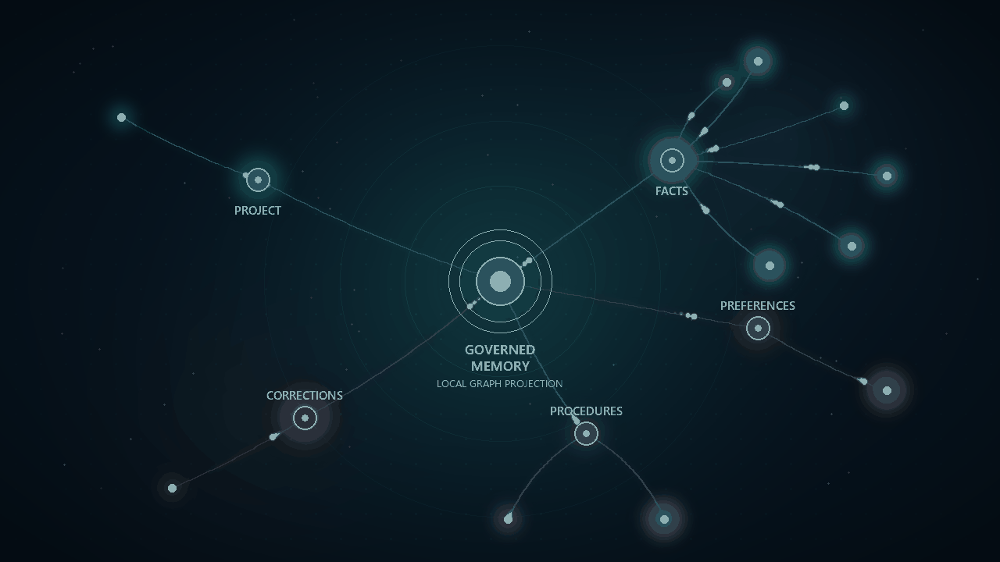
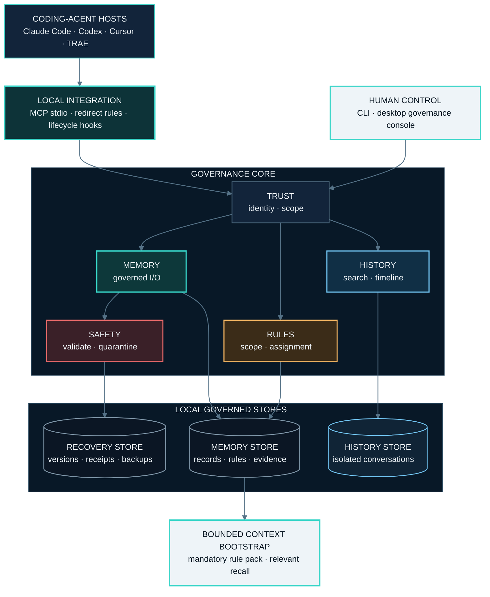
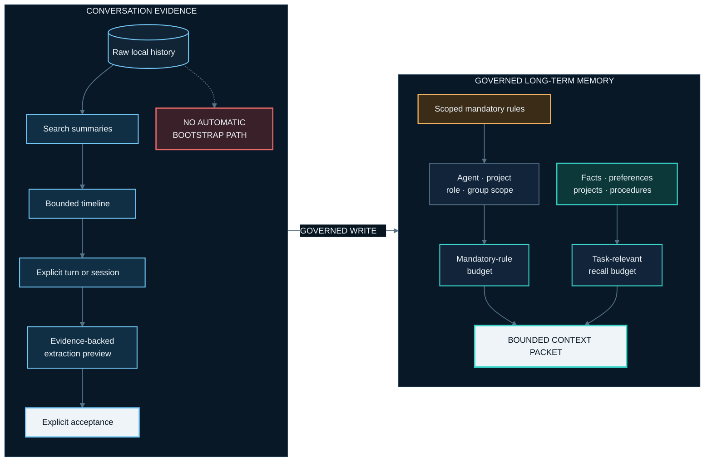

<h1 align="center">MemoryGuard</h1>

<p align="center">
  <strong>Governed shared memory for coding agents.</strong><br />
  Local-first MCP memory with automatic organization, scoped rules, evidence, and rollback.
</p>

<p align="center">
  <a href="https://pypi.org/project/agent-memguard/"></a>
  <a href="https://github.com/irisxc4/memoryguard/actions/workflows/ci.yml"></a>
  <a href="https://github.com/irisxc4/memoryguard/blob/main/pyproject.toml"></a>
  <a href="LICENSE"></a>
  <a href="README.zh-CN.md">中文文档</a>
</p>

> Let agents write without turning shared memory into an unreviewed pile.
> MemoryGuard organizes each write, preserves the evidence behind changes, and
> keeps governance decisions reversible.
>
> **No account. No remote server. No telemetry. Memory stays local.**

<p align="center">
  <a href="#quick-start">Quick start</a> ·
  <a href="#upgrade">Upgrade</a> ·
  <a href="#knowledge-library">Knowledge Library</a> ·
  <a href="#system-architecture">Architecture</a> ·
  <a href="#supported-hosts">Supported hosts</a> ·
  <a href="#privacy-and-safety">Privacy and safety</a>
</p>

<p align="center">
  
</p>

<p align="center">
  <sub>A synthetic governed projection: signals move through memory categories while raw conversation text remains outside the graph.</sub>
</p>

## Why MemoryGuard

Persistent memory solves storage. It does not solve governance.

When several coding agents write into the same context, records become
duplicated, stale, contradictory, over-broad, or unsafe to reuse. MemoryGuard
sits between coding agents and their shared memory to keep that context usable.

| Without governance | With MemoryGuard |
|---|---|
| Notes accumulate without a canonical state | Writes are classified, deduplicated, superseded, or surfaced as conflicts |
| A correction silently destroys the old value | Evidence and supersede chains preserve what changed and why |
| Tokens and credentials can remain active | Sensitive-looking content is quarantined from active memory |
| Every write needs manual approval | Agents write normally; people review exceptions and outcomes |
| Raw chat logs leak into future context | Conversation history remains a separate, explicitly read evidence archive |

## System architecture



## Quick start

### 1. Install

```bash
python -m pip install agent-memguard
```

For the desktop governance console:

```bash
python -m pip install "agent-memguard[gui]"
```

### 2. Authorize the current project

```bash
memoryguard source add .
```

### 3. Connect your coding agent

Run one provider installer:

```bash
# Claude Code
python -m memoryguard.provider_adapters install claude

# Codex
python -m memoryguard.provider_adapters install codex

# Cursor
python -m memoryguard.provider_adapters install cursor
```

Restart the host after installation, then verify the integration:

```bash
memoryguard doctor
memoryguard mcp-status
memoryguard hooks status --provider all
```

Launch the desktop console:

```bash
memoryguard gui .
```

`memoryguard-gui .` remains available for desktop shortcuts. In PowerShell and
other terminals, use `memoryguard gui .` so startup errors remain visible.

Provider-specific setup and behavior:

- [Claude Code installation](docs/install-claude-code.md)
- [Codex installation](docs/install-codex.md)
- [Cursor installation](docs/install-cursor.md)

## Upgrade

MemoryGuard currently upgrades through Python's package manager:

```bash
python -m pip install --upgrade agent-memguard
memoryguard --version
memoryguard doctor
```

If you installed the GUI extra, keep it during the upgrade:

```bash
python -m pip install --upgrade "agent-memguard[gui]"
```

There is no separate `memoryguard update` self-update command yet. The package
manager is the authoritative upgrade path, while MemoryGuard's schema
migrations run when the upgraded application opens its local stores.

## Knowledge Library

The desktop console can turn a selected folder into one governed local
knowledge library. Source files remain where they are; MemoryGuard stores the
searchable index in its user data home instead of copying a runtime database
into every source project.

| Capability | Current behavior |
|---|---|
| Folder ingestion | Add a folder as a book and ingest supported files as documents |
| Structure | Parse documents, preserve chapter/section context, and create traceable chunks |
| Retrieval | Full-text search, optional embeddings, and a layered knowledge graph |
| Natural synchronization | Re-ingest changed files; a partial or failed scan does not silently remove previously indexed content |
| Lifecycle | Move a book to the library trash, restore it, or explicitly purge its recovery snapshot |
| Memory candidates | Preview evidence-backed candidates before accepting them into governed long-term memory |

Open the desktop console and choose **Knowledge Library**. Remote embedding or
model-backed indexing is opt-in and requires explicit authorization; local
full-text retrieval remains available without sending source text to a remote
provider.

## Write and governance lifecycle


The console is not an approval queue. Agents keep moving. MemoryGuard records
the outcome and exposes the evidence needed to correct it later.

## What you can govern

| Signal | Governance action |
|---|---|
| Duplicate or stale memory | Inspect the canonical record and supersede chain; restore an earlier version when needed |
| Conflicting memories | Keep both visible until the conflict is resolved deliberately |
| Secrets, tokens, or credentials | Quarantine the record so it cannot enter active shared memory |
| Incorrect automatic organization | Correct, merge, lock, restore, or roll back with evidence |
| Multiple coding agents | Bind agents to one shared group while preserving source identity and scope |
| Mandatory rules | Assign rules to an Agent, project, provider, runtime role, or shared group |

## Rules and history stay separate

MemoryGuard deliberately keeps governed long-term memory and raw conversation
history on different paths.

| Surface | Purpose | Context behavior |
|---|---|---|
| **Rules and habits** | Preferences, procedures, corrections, facts, projects, and scoped mandatory rules | Mandatory rules use a bounded independent budget; ordinary records are recalled when relevant |
| **Conversation history** | Local raw-evidence archive with owner and shared-group access controls | Never enters bootstrap automatically; raw text is read only through explicit history tools |
| **Neuron graph** | Navigation and governance over memory, rules, projects, agents, and sessions | History nodes contain safe metadata and summaries, not raw chat content |

History retrieval is progressive: search results, then a bounded timeline, then
an explicitly selected turn or session. Extracting from history creates a
preview first; it does not silently write a long-term memory.



## Supported hosts

| Host | Integration | Current boundary |
|---|---|---|
| Claude Code | Global MCP binding, redirect rules, user-level lifecycle Hook | Verified takeover path |
| Codex | Global MCP binding, redirect rules, user-level lifecycle Hook | Verified takeover path |
| Cursor | Global MCP binding, redirect rules, user-level lifecycle Hook | Verified takeover path |
| TRAE | MCP binding and redirect rules | No verified Hook seam; reported as a fallback instead of full takeover |

Provider status is reported honestly as redirected, observed, operational, or
unsupported. MemoryGuard does not claim it can disable every host's native
memory when the host exposes no reliable integration point.

## Architecture

| Layer | Responsibility |
|---|---|
| **Evidence** | Authorized files, documents, host-native memory, external MCP descriptors, and conversation archives |
| **Memory** | Local SQLite shared-memory stores, scoped rules, provenance, conflicts, quarantine, and versions |
| **Governance** | MCP tools, CLI, desktop console, provider adapters, Hooks, confirmation bridges, and rollback |

The shared-memory store is the governed source of truth. Evidence remains
traceable without being treated as automatically trusted memory.

## Privacy and safety

- MemoryGuard runs as a local MCP stdio server.
- All governed data stays local unless you explicitly authorize a remote model
  or embedding operation.
- The Knowledge Library database uses `MEMORYGUARD_HOME` or the platform user
  data directory, so a selected source folder does not receive its own
  knowledge database.
- Some shared-memory, conversation-history, audit, and recovery artifacts still
  use an authorized workspace's `.memoryguard/` directory in the current
  release. Storage is therefore local, but not yet fully centralized.
- Source scanning is read-only by default.
- Mutating governance paths use validation, explicit scope, provenance, and
  reversible state.
- Quarantined records stay outside active shared memory.
- Raw conversation history is never injected into bootstrap automatically.
- Shared-group history access follows current active membership and does not
  grant deletion rights over another Agent's source.

## CLI

The installed `memoryguard` command exposes these top-level operations:

| Command | Purpose |
|---|---|
| `audit [path]` | Run a read-only audit and generate a report |
| `open [path]` | Open the latest interactive report |
| `explain <finding_id>` | Explain evidence and risk for a finding |
| `plan <finding_ids...>` | Build a minimal fix plan without writing |
| `apply <plan_id>` | Apply a confirmed plan with backup and rescan |
| `verify` | Compare the workspace before and after a change |
| `undo <change_id>` | Restore a backed-up change and verify it |
| `source <action>` | List, add, remove, or preview authorized sources |
| `scan` | Scan authorized sources and build the coverage ledger |
| `import <action> <bundle>` | Preview or create an offline import bundle |
| `doctor` | Diagnose installation and integration state |
| `mcp-status` | Inspect local shared-memory groups |
| `hooks <action>` | Install, inspect, pause, repair, or remove host Hooks |
| `gc [path]` | Preview or apply garbage collection for rebuildable artifacts |
| `gui [path]` | Launch the interactive governance console |
| `desktop` | Launch the trusted desktop executor |

Run `memoryguard --help` or `memoryguard <command> --help` for the live command
reference.

## MCP API

The MCP server exposes tools for:

- governed memory read, search, write, update, delete, and status;
- bounded context bootstrap with mandatory-rule isolation;
- rule creation, feedback, merge governance, undo, and scope statistics;
- Agent binding and shared-group inspection;
- source scanning, graph projection, import previews, and build planning;
- external MCP discovery and import;
- document extraction previews and candidate acceptance;
- conversation-history search, timeline, explicit read, export, deletion, and
  extraction preview;
- provider installation and host-agent enrichment.

Use MCP `tools/list` as the source of truth for the exact tool set supported by
the installed version.

## Project links

- [PyPI package](https://pypi.org/project/agent-memguard/)
- [GitHub releases](https://github.com/irisxc4/memoryguard/releases)
- [Memory continuity and lossless storage spec](docs/memory-continuity-storage-spec-v1.md)
- [Contributing guide](CONTRIBUTING.md)
- [Contributor License Agreement](CLA.md)
- [Issue tracker](https://github.com/irisxc4/memoryguard/issues)

## Roadmap

- **Current:** local MCP memory, automatic organization, scoped rules,
  conversation evidence, Knowledge Library, provider adapters, governance UI,
  and rollback.
- **Next:** content-addressed deduplication, natural source synchronization,
  delta/checkpoint storage, derived-index maintenance, and clearer governance
  reports. Long-term records are not retired merely because they are old.
- **Later:** team and enterprise capabilities only after validated demand.

## Contributing

Issues and pull requests are welcome. Read [CONTRIBUTING.md](CONTRIBUTING.md)
before submitting a change. Pull requests require agreement to the
[CLA](CLA.md).

## License

[MIT](LICENSE)
