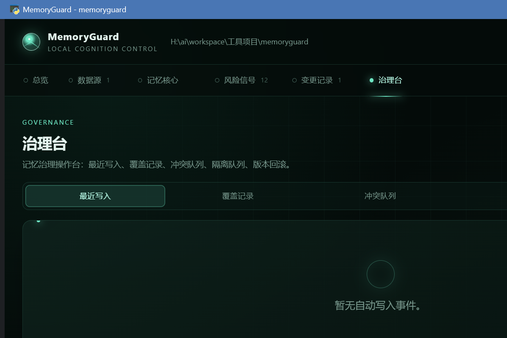
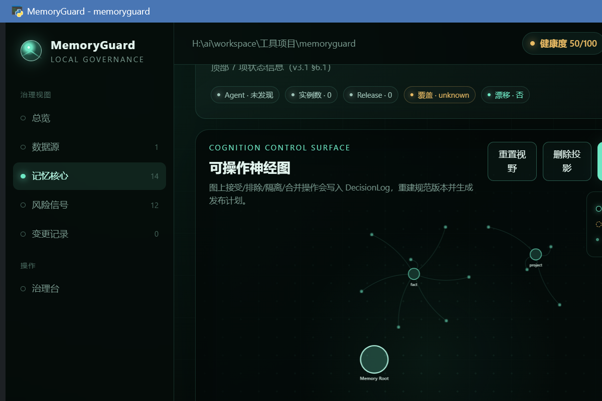
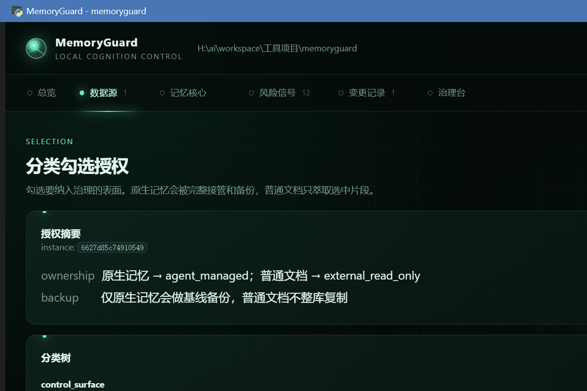

<p align="center">
  
</p>

<h1 align="center">MemoryGuard v0.4.0</h1>

<p align="center">
  <strong>Shared memory for coding agents, without shared-memory chaos.</strong><br />
  A local-first MCP memory layer that organizes writes automatically and keeps every governance decision reversible.
</p>

<p align="center">
  <a href="https://pypi.org/project/agent-memguard/"></a>
  <a href="https://github.com/irisxc4/memoryguard/blob/main/pyproject.toml"></a>
  <a href="LICENSE"></a>
  <a href="README.zh-CN.md">中文文档</a>
</p>

> Your agents can write freely. MemoryGuard classifies, deduplicates, supersedes, quarantines, and compresses shared memory on every write - then lets you inspect, correct, or roll back the result afterward.
>
> **No account. No server. No telemetry. Your memory stays local.**

<p align="center">
  <a href="#install-in-60-seconds">Install in 60 seconds</a> ·
  <a href="#see-the-governance-loop">See the governance loop</a> ·
  <a href="#what-memoryguard-is-and-isnt">What it is and isn't</a>
</p>

## Why MemoryGuard

Persistent memory solves only half the problem. When several coding agents write into the same context, memory can become duplicated, stale, contradictory, or unsafe to reuse.

MemoryGuard is the local control layer between your coding agents and their shared memory:

| Instead of | MemoryGuard gives you |
|---|---|
| A growing pile of unreviewed notes | Write-time classification, deduplication, superseding, conflict detection, quarantine, derivation, and compression |
| Approving every agent write by hand | Automatic writes; human review only when you need it |
| Treating an overwrite as permanent | History, evidence, supersede chains, and rollback |
| Sending project context to another service | A local MCP stdio server with local SQLite storage |

## See the governance loop

<p align="center">
  
</p>

```text
Agent writes memory
  -> MemoryGuard MCP write
  -> auto-organize
      classify · deduplicate · supersede · detect conflict · quarantine · compress
  -> active shared memory
  -> governance console
      inspect · correct · merge · lock · restore · roll back
```

The console is **not an approval queue**. Agents keep moving; you govern the outcome with evidence when it matters.

## Rules, habits, and conversation history

These are deliberately separate surfaces:

| Surface | Purpose | Injection behavior |
|---|---|---|
| **Rules & habits** | Governed long-term preferences, procedures, corrections, and scoped mandatory rules | Mandatory rules are injected only into their assigned Agent/project/provider/role; ordinary records are recalled on demand |
| **Conversation history** | Local raw-evidence archive; personal reads are isolated and active shared-group members may query one another | Never enters bootstrap; the neuron graph carries metadata-only project → Agent → session indexes |

History retrieval is progressive: **search result → bounded timeline → one raw
turn/session**. `extract preview` only proposes evidence-backed memory
candidates; it never writes a long-term memory. A user can explicitly govern a
candidate through the normal memory path. Hooks archive only payloads exposed by
their verified host seam, honor private/disabled markers, and report partial
coverage rather than inventing unseen assistant text. A shared-history read is
resolved server-side from the caller's current active binding: it includes only
the group's current members and loses access immediately on leave. Shared
visibility never grants deletion of another Agent's source. Imported sessions
are grouped by trusted `cwd`/`project_ref` metadata (or “unknown”), never by
chat body.

<p align="center">
  
</p>

The neuron graph is a governed view: select a node to inspect and manage the
corresponding record without turning raw conversation history into injected
memory.

## Install in 60 seconds

```bash
pip install agent-memguard
```

Choose the coding agent you use. Each command installs the global MCP binding,
redirect rules, and the verified user-level Hook supported by that host.

```bash
# Claude Code
memoryguard source add . && python -m memoryguard.provider_adapters install claude

# Codex
memoryguard source add . && python -m memoryguard.provider_adapters install codex

# Cursor
memoryguard source add . && python -m memoryguard.provider_adapters install cursor
```

Then restart your agent and verify the environment:

```bash
memoryguard doctor
memoryguard mcp-status
memoryguard hooks status --provider all
```

Need a desktop window for the governance console?

```bash
pip install "agent-memguard[gui]"
```

For explicit configuration and provider-specific behavior, see the [Claude Code](docs/install-claude-code.md), [Codex](docs/install-codex.md), and [Cursor](docs/install-cursor.md) guides.

## What you can govern

<p align="center">
  
</p>

Sources are authorized explicitly. Native memory can be governed with a backup;
ordinary documents remain read-only evidence until you choose to extract them.

| Signal | What you can do |
|---|---|
| Duplicate or stale memory | See the supersede chain and restore the prior version if needed |
| Conflicting memories | Surface the conflict and resolve it deliberately |
| Secrets, tokens, or credentials | Quarantine them instead of leaving them in active shared memory |
| A wrong governance decision | Inspect its history and roll the shared memory back to a version snapshot |
| Multiple coding agents | Bind agents to a governed shared-memory group |

## What MemoryGuard is - and isn't

MemoryGuard is a **local MCP memory backend and governance console** for coding agents. It provides a shared source of truth and organizes writes as they arrive.

It is not a cloud service, an account system, or a human gate that blocks every memory write. It also does not pretend every agent's native memory can be disabled: provider support is reported as redirected, observed, or unsupported where appropriate.

## Architecture

| Layer | Responsibility |
|---|---|
| **Evidence layer** | Agent-native memory, files, documents, and external MCP descriptors; raw inputs, not governance truth |
| **Memory layer** | MemoryGuard's local MCP shared-memory backend; the governed shared source of truth |
| **Governance layer** | GUI and CLI for observation, evidence, corrections, and reversible changes |

## Core surfaces

| Surface | Use it for |
|---|---|
| MCP memory backend | Read, search, write, update, delete, and inspect shared-memory status |
| Auto-organizer | Classify, deduplicate, supersede, detect conflicts, quarantine, derive, and compress on write |
| Governance console | Review raw writes, conflicts, quarantine, supersede chains, and versions |
| Provider adapters | Set up global MCP, redirect rules, and Hooks for Claude Code, Codex, or Cursor; report the TRAE fallback honestly |
| CLI | Audit local sources, manage authorized inputs, inspect reports, and manage memory builds/releases |

The complete MCP tool reference and CLI command reference are below for evaluation and integration work.

<details>
<summary><strong>CLI commands</strong></summary>

| Command | Description |
|---|---|
| `audit [path]` | Read-only scan; generate a report |
| `open [path]` | Open the latest report in a window |
| `explain <finding_id>` | Explain a finding's evidence and risk |
| `plan <finding_ids...>` | Generate a minimal fix plan without writing |
| `apply <plan_id>` | Apply a plan: backup, patch, and rescan |
| `verify` | Rescan and compare before/after |
| `undo <change_id>` | Restore from backup and re-verify |
| `source <action>` | Manage authorized sources |
| `scan` | Read-only scan and coverage ledger |
| `import <action> <bundle>` | Preview or create an offline import bundle |
| `memory <action>` | Memory build, verify, and release rollback workflows |
| `doctor` | Diagnose installation and environment |
| `mcp-status` | Inspect MCP shared-memory status |
| `hooks <action>` | Install, repair, inspect, pause, or remove host Hooks |

</details>

<details>
<summary><strong>MCP tools</strong></summary>

| Group | Tools |
|---|---|
| Memory backend | `memoryguard_memory_read`, `memoryguard_memory_search`, `memoryguard_memory_write`, `memoryguard_memory_update`, `memoryguard_memory_delete`, `memoryguard_memory_status` |
| Audit and scan | `memoryguard_audit`, `memoryguard_explain`, `memoryguard_list_sources`, `memoryguard_scan_summary`, `memoryguard_neuron_graph`, `memoryguard_import_preview`, `memoryguard_build_plan` |
| Agent binding | `memoryguard_binding_create`, `memoryguard_binding_list` |
| External MCP | `memoryguard_external_mcp_list`, `memoryguard_external_mcp_import` |
| Document extraction | `memoryguard_extract_memories`, `memoryguard_accept_candidates` |
| Semantic and provider | `memoryguard_semantic_check`, `memoryguard_provider_install` |

</details>

### Mandatory rules

`memoryguard_memory_write` defaults to `injection_policy="relevant"`. Use
`always` (and optional bounded `priority`) only for an explicit long-term
mandatory/default rule; do not promote every procedure. `memoryguard_memory_update`
can switch the policy. Bootstrap injects mandatory rules under an independent
budget before relevant recall and fails closed for sensitive or over-limit rule
packages. The GUI can return a rule to on-demand, delete, or restore it.

## Privacy and safety boundaries

- MemoryGuard runs as a local MCP stdio server; it requires no account, remote server, or telemetry.
- Shared memory is stored locally in SQLite under `.memoryguard/`.
- Source scanning is read-only by default. Changes use explicit plans, backups, rescans, and undo paths.
- A quarantined memory is deliberately kept out of active shared memory until you decide what to do with it.

## Roadmap

- **Now:** local MCP backend, auto-organization, governance console, provider adapters, and rollback.
- **Later:** enhanced governance signals such as decay, derivation, and governance reports. No committed date.
- **Later:** team and enterprise capabilities after proven demand. No committed date.

## Changelog

### v0.4.0 (2026-08-01)

- Add scoped rules and governed conversation-history storage and import.
- Add neuron-graph governance controls in the desktop GUI.
- Harden Hook UTF-8 handling and write receipts for Windows hosts.

### v0.3.2 (2026-07-29)

- Force Hook stdin, stdout, and stderr to UTF-8 so Chinese context survives
  Windows GBK defaults
- Add the official Codex `commandWindows` override and run every Hook with
  Python UTF-8 mode
- Bind runtime receipts to the exact installed Hook definition so changed
  commands cannot inherit a stale operational status
- Defer pending-memory reminders from `PreCompact` to
  `SessionStart(source="compact")`, matching the Codex event output contract

### v0.3.1 (2026-07-29)

- Migrate legacy unmarked Codex MCP sections before installing the managed
  section, preventing duplicate TOML tables during upgrades
- Make `memoryguard doctor` output safe on GBK Windows consoles

### v0.3.0 (2026-07-29)

**Hook-only automatic takeover**:
- User-level Hook management for Claude Code, Codex, and Cursor; TRAE keeps the verified MCP + rules fallback
- Bounded, task-relevant context injection for main agents and subagents
- Native-memory write interception so long-term memory stays in the MemoryGuard-managed store
- Enforce, observe, pause, repair, status, and uninstall controls in CLI and GUI
- Idempotent configuration merges that preserve unrelated user hooks

**MCP and Skill integration**:
- Global provider installation now installs MCP, redirect rules, and supported Hooks together
- First Skill activation detects only the current host and repairs its integration
- Runtime receipts expose whether the takeover path is actually operational

### v0.2.0 (2026-07-23)

**重构记忆发布与回滚**:
- 重构记忆 → 投影文件 → 目标文件的完整发布链路
- 目标文件 hash 校验：发布后若目标文件被修改，禁止回滚（避免误伤后续修改）
- 发布状态追踪：`applied_verified` / `rolled_back` / `published`
- 回滚版本列表 UI：只展示真正可回滚的版本，清晰显示状态

**UI/UX 改进**:
- 回滚版本选择弹窗：radio 单选 + 确认按钮，替代 prompt 输入
- 神经图谱：节点点击自动展开详情，操作反馈即时显示
- 重构记忆自动确认写入：不再每个光点都需要手动接受

**安全与稳定性**:
- 目录可写性预检：发布前检查目标目录权限，避免 PermissionError
- 备份校验：`existed_before=true` 时必须有 backup_path 存在
- 目标文件存在性检查：文件不存在时给出明确原因

**新增测试**:
- 发布目标验证测试
- 回滚状态判定测试
- 投影模式测试
- 安全测试

## Contributing

Issues and pull requests are welcome. Read [CONTRIBUTING.md](CONTRIBUTING.md); by submitting a pull request, you agree to the [CLA](CLA.md).

## License

[MIT](LICENSE)
