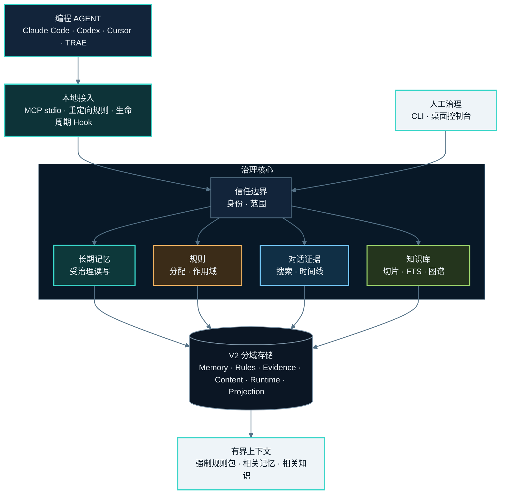

<h1 align="center">MemoryGuard</h1>

<p align="center">
  <strong>面向编程 Agent 的受治理共享记忆。</strong><br />
  本地优先的 MCP 记忆层，提供自动整理、范围规则、证据链和可逆治理。
</p>

<p align="center">
  <a href="https://pypi.org/project/agent-memguard/"></a>
  <a href="https://github.com/irisxc4/memoryguard/actions/workflows/ci.yml"></a>
  <a href="https://github.com/irisxc4/memoryguard/blob/main/pyproject.toml"></a>
  <a href="LICENSE"></a>
  <a href="README.md">English</a>
</p>

> Agent 可以正常写入，MemoryGuard 负责分类、去重、冲突识别、隔离和版本治理。
> 每次变化保留证据，之后仍可修正、恢复或回滚。
>
> **无账号、无远端服务器、无遥测。数据默认留在本地。**

<p align="center">
  <a href="#快速开始">快速开始</a> ·
  <a href="#升级">升级</a> ·
  <a href="#知识库">知识库</a> ·
  <a href="#系统架构">系统架构</a> ·
  <a href="#隐私与安全边界">隐私边界</a>
</p>

<p align="center">
  
</p>

<p align="center">
  <sub>神经图展示受治理投影；原始对话正文不会直接进入图谱或自动注入上下文。</sub>
</p>

## v0.7.6 更新

v0.7.6 是一次聚焦 Codex Hook/MCP 运行时可靠性的修复版本：

- **统一运行时快照：** Codex 生命周期 Hook 与 MCP 共用同一个按内容键控的不可变
  runtime snapshot，不再因 PATH 与包元数据解析不同而发生版本漂移。
- **并发工具安全：** session state 写入只在短暂、可重入的跨进程锁窗口内完成，不再
  锁住整个 Hook 执行；并发工具与子代理调度不会互相等待至超时。
- **Bootstrap 状态一致：** bootstrap 失败会清除过期成功状态，恢复后清除旧错误并记录
  稳定 context hash。普通 Stop 故障保持 fail-open；明确的 mandatory budget 溢出会
  留给下一次工具调用 fail-closed。
- **Agent 身份稳定：** 内置 Grok Profile 会从已安装的用户级表面发现；只有已验证的
  provider、CLI 或 MCP 元数据才会映射为稳定程序身份。通用或不透明值保持未解析，不会
  猜测归类。
- **治理台结构清晰：** GUI 按参考图采用七页信息架构，固定导航、中央工作区和上下文侧栏
  分工明确。Agent 卡片显示可读名称、来源摘要和安全的程序族图标回退；技术 ID 仅在收起的
  详情中展示。

详见 [v0.7.6 发布记录](docs/releases/v0.7.6.md)。

## v0.7.5 更新

v0.7.5 是一次聚焦冲突复核正确性的修复版本：

- **可读冲突快照：** 冲突成员从 V2 atom/tombstone 历史返回有界、脱敏的正文预览，
  复核视图保留上下文，同时不暴露原始正文。
- **原因清晰、候选安全：** 已知冲突原因显示中文说明；已删除、已替代、已拒绝、
  已隔离、已覆盖、缺失或其他失效成员不可选为保留版本。
- **失效时保持 fail-closed：** 只有至少两条仍有效且可选的成员才能解决冲突；失效的
  历史冲突组仍可供审计查看，不会变成可变更目标。
- **计数诚实分离：** 历史冲突组总数与治理概览使用的可处理冲突数分别统计。

详见 [v0.7.5 发布记录](docs/releases/v0.7.5.md)。

## v0.7.4 更新

v0.7.4 是一次治理正确性与运行时可靠性修复版本：

- **Canonical 合并更新：** 相关规则、习惯和记忆合并为持续演进的一条
  canonical 记录，同时保留神经图分支、来源、作用域、证据和可逆历史。
- **强制上下文有界治理：** 超过 20 条强制规则只产生健康告警，不再截断存储或注入；
  字符/Token 预算、敏感内容和损坏治理状态仍然 fail-closed。
- **治理信息可读：** Agent、自动决策和风险信号显示可读名称与解释；治理分组默认收起，
  冲突和风险摘要可直接打开详情；风险条目显示原因、影响和建议；CodeGraph 与 GUI
  共用受治理的身份、作用域和证据链路。
- **审计状态可靠：** `run_audit` 和 `get_audit` 返回明确的完成状态与带时区时间；GUI
  完成扫描后不再停留在“待扫描”，阅读弹层保持在导航之上；缺少数字健康证据时保持
  不可用，不伪造分数。治理阶段显示可读的已完成、当前、待开始或不可判定状态。
- **Codex 运行时安全：** Hook/bootstrap 错误分类准确，`NO_SOURCE` 作为中性回退；
  Provider 安装使用内容键不可变、非 editable 的 MCP snapshot，构建失败原子保留旧运行时，
  自动刷新包静态资源，并提供 PEP 610 copied-install 来源诊断。
- **安全变更与迁移：** GUI 局部变更和 evidence 冲突保持原子性并保留最近有效状态；
  system `group_outbox` 投影与 checkpoint 在同一事务推进，旧滞后 checkpoint 可安全修复，
  pending/failed 事件保持 fail-closed，不会被当作成功投影；迁移 replay 契约验证幂等重试和失败证据。

本版本采用既有增量 CI 尾段（`447/447` 通过）、相关专项测试和 `git diff --check` 作为证据；
本次发布准备未重新运行全量测试。

详见 [v0.7.4 发布记录](docs/releases/v0.7.4.md)。

## v0.7.3 更新

v0.7.3 放开共享组跨 provider 的历史召回。删除仍只限 owner。

详见 [v0.7.3 发布记录](docs/releases/v0.7.3.md)。

## v0.7.2 更新

v0.7.2 是一次聚焦正确性与兼容性的修复版本：

- **写入→读回与作用域：** trusted Agent/project scope 在写入与读回路径中保持一致，
  成功写入的记忆可以在同一作用域下读回，同时不放宽隔离边界。
- **Codex Hook 生命周期与传输：** 生命周期清理使用已验证的 Codex thread/workspace
  证据，普通 `Stop` 仍可恢复，并谨慎收敛已终止或已删除的 thread。传输修复会规范当前
  Python 解释器与 UTF-8 stdio，并验证 `initialize`、`tools/list`、`memory_status` 和
  `memory_read`。
- **Python 3.10 兼容：** Codex 传输修复路径统一使用项目的
  `memoryguard.toml_compat` 接口；Python 3.11+ 使用标准库 `tomllib`，Python 3.10 使用
  `tomli`。

详见 [v0.7.2 发布记录](docs/releases/v0.7.2.md)。

## v0.7.1 更新

v0.7.1 补齐 V2-only 切换后暴露的迁移与桌面生命周期缺口：

- **一条命令完成迁移：** 升级 Python 包后直接运行 `memoryguard upgrade`。
  裸命令使用权威用户数据目录，迁移并验证 Binding、Group、记忆、规则、历史与来源，
  激活 V2 后只清理本次成功迁移产生的备份。零写入检查使用
  `memoryguard upgrade --preview`。
- **统一控制目录：** 裸 `memoryguard gui`、`doctor`、`mcp-status`、`hooks`、
  `groups` 与存储命令都指向同一用户级数据目录，不再随终端当前目录切换数据库。
- **恢复 Agent / Group：** V1 迁移来的绑定和共享/个人组继续可编辑；已发现但未绑定、
  也还没有原生记忆的 Agent，可以直接启用个人记忆层。检测只读取注册的产品/Profile
  表面，不猜扫整台电脑，也不读取候选正文。
- **真实构建引擎：** 重构弹窗只列出本机可执行的 Agent CLI，例如 Cursor Agent、
  Codex。选中后由后台受治理任务真正执行抽取/富化；确定性模式明确标注，不再伪造
  `host skill` 或“在其他对话继续”的文案。
- **可靠启动与取消：** 每个可信 scope 同时只允许一个构建。TaskRun ID 可恢复，
  僵尸 owner 会被安全回收；取消会停止归属 CLI 子进程，所有失败/取消/超时路径都回到
  神经图页面，不再卡在 `starting / 0%`。
- **治理链路收口：** canonical 规则、记忆去重、压缩、知识引用和有界上下文注入统一
  保留 identity、policy、priority、audience、scope、provenance 与 evidence。
  Graphify 仍作为 MemoryGuard CodeGraph 后的可选 metadata Provider 集成，不是独立
  MemoryGuard runtime，也不单独发布 PyPI 包。

最终本地全量回归：**1884 passed / 0 failed**，覆盖 **205 个测试文件**。详见
[v0.7.1 发布记录](docs/releases/v0.7.1.md)。

## v0.7.0 更新（V2-only；已于 2026-08-12 发布）

v0.7.0 是 V2-only。本地发布验收已通过，并于 2026-08-12 发布到 GitHub
与 PyPI。MemoryGuard 自己拥有 CodeGraph 边界；Graphify 只是可选的提取
Provider，不是第二套 MemoryGuard runtime，也不单独作为 MemoryGuard 包发布。
本节说明发布边界与证据。Graphify 结果是真实全仓 export/projection，不表示
upstream Graphify 的全仓测试套件通过。

- **V1 runtime 已物理淘汰：** 生产入口导入闭包不再包含 V1 runtime/store
  模块。`V1_ACTIVE` 只是迁移起点，不是可运行 fallback；旧格式只允许由
  `memoryguard.migration` 读取，其他入口统一 fail-closed 返回
  `v2_upgrade_required`。V1 数据与 migration-backups 只作为回滚/审计证据，
  不再是 V2 runtime 写入目标。
- **V2 六个控制面：** Memory、Evidence、History、Source、Binding、Group
  全部走 V2-native 边界。Memory atom 与 evidence/decision receipt 和原始
  History 分离；授权 Source 文件/文件夹与 runtime 分离；可信 Agent Binding
  决定所属治理 Group。
- **Canonical governance：** canonical reconciliation 生成
  `shared_baseline`、`agent_overlay`、`project_overlay`，保留 durable source
  link，完成 parity 校验后才激活 canonical read path，再把旧重复项可恢复地
  shadow。V2 自动整理在同一 share group 内做 exact/semantic 去重，结果明确为
  deduplicated、superseded、conflicted 或 quarantined。规则重复扫描生成受治理
  merge proposal；merge 与 supersede 均保留 evidence、scope、幂等和 undo receipt。
- **跨 Agent 同组治理：** 同一可信 `share_group_id` 的成员共享有界候选与治理
  视图，其他 Group 无法进入；Agent identity 仍保留在 provenance。
- **知识库文件/文件夹：** 选中文件夹可建 book，选中文件可作为 document 入库；
  Content Plane 独占正文，Knowledge 只保留 metadata/reference。支持 re-ingest、
  remove/restore/purge，候选必须显式 review 后才进入长期记忆。
- **GUI Agent 与 Group：** native GUI 可发现 Agent 名称/实例、保存来源选择、
  查看 binding、把成员加入 shared/personal group、检查 drift、离开或解散 Group；
  变更通过事务 receipt 与 system outbox 提交。
- **GUI 构建与后台收尾：** projection、Knowledge、import、history、maintenance、
  release、compatibility 使用持久 V2 `TaskRun`；状态可恢复，取消协作且有界，
  shutdown 前必须完成 owned worker/process 清理。
- **CodeGraph / Graphify：** MemoryGuard 自己拥有可信、无正文的 CodeGraph adapter
  与 projection；Graphify 只是提供 metadata-only export 的可选提取 Provider，不单独
  发布成 MemoryGuard runtime。CodeGraph 保留 source role、provenance、source map、
  revision、tombstone、outbox，并提供有界 query/path/explain/affected 与
  production-only 过滤。
- **安全与回滚：** unknown/corrupt state、缺失 scope、非法 provenance、reparse
  路径、不安全 metadata、过期幂等请求均 fail-closed。公共 receipt 脱敏正文和路径；
  governance/audit/outbox 保留决策。release rollback 通过有 scope 的 receipt 恢复
  Content Plane blob 与 held occurrence，不信任未绑定 backup path。
- **本地发布验收证据：** `1761 / 1761`，无 skip/xfail；V1 retirement + CodeGraph
  `15 / 15`；Graphify 专项 `3 / 3`；canonical reconciliation `ACCEPTED`；
  RuleMerge `46 / 46`；v3.2 `27 / 27`。真实全仓 Graphify export/projection 为
  `486 files / 11672 nodes / 38714 edges → 11667 canonical symbols / 38714 edges`；
  query/path/affected 通过，失败原子性全为 `0`。
- **最终制品证据：** clean wheel `206 files`、`legacy bad=0`；隔离包、CLI、MCP
  均报告 `0.7.0`；desktop help 通过。

local release acceptance passed。v0.7.0 已于 2026-08-12 发布到 GitHub 与 PyPI。
上述 Graphify 仅表示专项 `3 / 3` 与真实全仓 export/projection 通过，
不表示 upstream Graphify 的全仓测试套件通过。详见
[v0.7.0 发布记录](docs/releases/v0.7.0.md)。

### v0.6.2 兼容基线

Python 3.10 SQLite 修复仍是 v0.7.0 升级基线：Memory、Evidence、Content 的 schema
preflight 检查包含 `-wal`/`-shm` 的私有副本，物理只写验证不会观察或 checkpoint live
database。历史发布说明保留在 [docs/releases/v0.6.2.md](docs/releases/v0.6.2.md)。

## v0.6.0 重大 V2 重构

v0.6.0 不是单纯的存储升级，而是生产数据平面的整体重构：

- **权威 V2 分域：** Memory、Rules、Evidence、Content、Runtime、Projection、Assets、CodeGraph、Skills、System 分离为明确的 SQLite 域，并由治理边界统一约束。
- **显式切换：** `V1_ACTIVE → V2_BUILDING → V2_READY → V2_ACTIVE` 全程 fail-closed；进入 READY/ACTIVE 后不会静默回落旧存储，也不会双写。
- **无损迁移：** frozen-source 准备使用一致的 SQLite online backup，校验源/目标证据，复核 live-source drift，并保留 V1 数据与 migration-backups 以支持回滚。
- **Native 路由收口：** MCP、CLI、GUI、Hook 全部显式分类；233 个切换面中 138 个实现、95 个退休，neutral/blocker 均为 0。
- **治理智能链路：** Rule lifecycle、RuleMerge、抽取/富化、External MCP 导入、provider 控制面、会话历史、Knowledge Library 与 GUI 治理统一走 V2 evidence/decision 流程。
- **运维证据：** Reference Audit、分域 SQLite 健康检查、受保护维护、回滚证据和未绑定 Agent 的安全诊断共同参与 readiness 与运维。

## 为什么需要 MemoryGuard

持久化只解决“存下来”，没有解决“以后还能不能可靠复用”。

| 没有治理 | 使用 MemoryGuard |
|---|---|
| 笔记持续堆积，没有规范状态 | 写入会被分类、去重、覆盖或标记冲突 |
| 纠错直接覆盖旧值 | 证据和 supersede 链保留变化原因 |
| Token、凭证可能继续活跃 | 敏感内容进入隔离区，不参与活跃召回 |
| 每条写入都要人工审批 | Agent 正常工作，人只治理异常和结果 |
| 原始聊天自动混入未来上下文 | 对话历史独立保存，只能显式读取 |

## 系统架构



## 快速开始

### 1. 安装

```bash
python -m pip install agent-memguard
```

需要桌面治理台：

```bash
python -m pip install "agent-memguard[gui]"
```

### 2. 授权当前项目

```bash
memoryguard source add .
```

### 3. 连接 / 修复编程 Agent

全局 Provider 配置始终从用户级 canonical data home 的真实 binding 重建；重复执行是幂等的，也会清理被全局配置取代的 MemoryGuard 项目级覆盖。

```bash
# 单独修复
memoryguard provider repair claude
memoryguard provider repair codex
memoryguard provider repair cursor
memoryguard provider repair trae

# 一次修复全部已检测 Provider
memoryguard provider repair all
```

重启宿主后验证：

```bash
memoryguard doctor
memoryguard mcp-status
memoryguard hooks status --provider all
```

启动桌面治理台：

```bash
memoryguard gui
```

`memoryguard-gui .` 仍可用于桌面快捷方式。裸 `memoryguard gui` 始终打开固定用户级
控制目录（Windows 默认 `%LOCALAPPDATA%\MemoryGuard`），因此无论从项目目录还是
`C:\Windows\System32` 启动都不会静默切换数据库。`MEMORYGUARD_WORKSPACE` 是显式
运维覆盖；需要指定隔离工作区时仍可使用 `memoryguard gui <project-path>` 或
`memoryguard gui --workspace <project-path>`。
它不再记住上次项目，也不会从启动目录推断工作区或弹出文件夹选择器。
在 Windows 上，`memoryguard gui` 会把原生窗口独立到后台进程，关闭 PowerShell 不会关闭 GUI。

详细说明：[Claude Code](docs/install-claude-code.md) ·
[Codex](docs/install-codex.md) · [Cursor](docs/install-cursor.md)

### 稳定的 Codex / Router 绑定

Codex/Router 绑定的是本机稳定的 Codex 程序与控制安装。账号 Profile 只是
endpoint/alias，不会成为新的记忆所有者：切换 Profile 时会自动发现或修复该
Profile，并复用已验证的 Agent 绑定和当前 active group。请求身份仍然
fail-closed；这不会让不同机器或任意账号共享记录。

## 升级

当前版本通过 Python 包管理器升级：

```bash
python -m pip install --upgrade agent-memguard
memoryguard --version
memoryguard doctor
```

安装过 GUI extra 时：

```bash
python -m pip install --upgrade "agent-memguard[gui]"
```

目前**没有**包级自更新命令。包管理器是正式升级入口；下面的
`memoryguard upgrade` 是工作区迁移，不是包自更新。

### 升级现有 V1 用户数据

先升级包，再执行完整验证迁移。正常用户数据目录不需要 workspace、data-home、apply
或 confirm 参数：

```bash
python -m pip install --upgrade agent-memguard
memoryguard --version                    # 0.7.6
memoryguard upgrade
memoryguard doctor
```

该命令构建 V2、校验 frozen/live source evidence、迁移 Agent/Group control，并仅在
所有门禁通过后激活；随后只删除本次成功迁移的备份批次。重复执行 `V2_ACTIVE` 是幂等的。
零写入检查使用：

```bash
memoryguard upgrade --preview
```

隔离安装仍可使用显式 workspace/data-home 高级参数。任一门禁失败都会保持非 active
并保留证据；成功激活后不会继续保留冗余迁移备份。

### 更早的 pre-V2 工作区：显式切换到 V2

v0.6.0 随包安装 `memoryguard-v2` 运维命令：

```bash
# 只读查看 manifest
memoryguard-v2 status -w .

# 生成 frozen-source V2 shadow，并只停在 V2_READY
memoryguard-v2 prepare -w . --apply

# 仅当 prepare 输出 V2_READY / ready=true 后显式激活
memoryguard-v2 activate -w . --confirm V2_ACTIVE
```

prepare 会使用 SQLite online backup 捕获一致快照，保留 V1 与
`migration-backups`，并在 READY 前检查 live-source drift；activate 在真正修改
manifest 前还会再检查一次 drift。升级过程中不要删除 legacy V1 数据，也不要删除
迁移备份。

## 知识库

桌面治理台可以把你选择的文件夹或文件集合加入本地知识库。源文件保持原位，
MemoryGuard 把检索索引写入用户数据目录，不会给每个资料项目复制一套知识库数据库；
Knowledge metadata 不会变成第二个正文存储。

| 能力 | 当前行为 |
|---|---|
| 文件/文件夹入库 | 文件夹作为一本书，选中文件作为文档进入索引 |
| 结构化处理 | 解析文档、保留章节/小节上下文、生成可追溯切片 |
| 检索 | 全文检索、可选 Embedding、分层知识图谱 |
| 自然同步 | 重新整理变更文件；部分扫描或失败不会误删以前已索引内容 |
| 删除治理 | 移入知识库回收站、恢复，或明确永久清理恢复快照 |
| 记忆候选 | 先预览带来源证据的候选，确认后才写入长期记忆 |

从桌面治理台进入**知识库**。远程 Embedding 或模型索引必须显式授权；未授权时，
本地全文检索仍可使用，不会把资料正文发送给远程 Provider。

### CodeGraph 刷新

首次构建 CodeGraph 仍必须显式确认并执行全量构建。Scope 建图后，每次成功的受信任
文件写入都可以触发该 Scope 的增量刷新，但仍要通过严格的源路径和 active binding
校验。内容 hash 未变化时不产生新 revision；删除的文件会失活；下一轮上下文只注入
一次有界的 `affected` receipt。该路径不运行 daemon 或 watcher，也不会从 shell 或
自由文本猜测路径。

### 桌面治理台页面

GUI 按七页信息架构组织：

1. 治理总览
2. 数据源与 Agent
3. 记忆核心
4. CodeGraph
5. 规则与习惯
6. 对话历史
7. 风险信号与治理控制台

Agent 列表显示可读的程序/provider 名称，底层 ID 只在详情中展示；没有数据时明确
显示空态。

## 规则、历史与知识分层

| 数据面 | 用途 | 上下文行为 |
|---|---|---|
| **长期记忆与规则** | 偏好、流程、纠错、事实、项目和范围化强制规则 | 强制规则在作用域/排除/冲突与语义去重后使用独立字符/Token 预算。生效条数超过 20 只是健康告警，不是硬上限，存储也不按条数封顶。敏感、损坏、单条超限和总量溢出仍失败关闭且不会静默截断；普通记录按任务相关性召回 |
| **对话历史** | 带 owner 和共享组权限的本地原文证据 | 永不自动进入 bootstrap，只能经历史工具显式读取 |
| **知识库** | 用户选择的文档资料、切片和派生索引 | 仅返回有界相关片段；候选不会静默变成长时记忆 |
| **神经图** | 导航记忆、规则、项目、Agent、会话和知识投影 | 展示安全元数据和摘要，不展示原始聊天正文 |

历史读取采用“搜索结果 → 有界时间线 → 指定 Turn/会话”的渐进路径。历史萃取先
生成预览，再经明确接受进入正常治理写入。

## 可治理内容

| 信号 | 治理动作 |
|---|---|
| 重复或过期记忆 | 查看规范记录和覆盖链，必要时恢复旧版本 |
| 相互冲突的记忆 | 同时保留两侧，直到明确裁决 |
| Secret、Token 或凭证 | 隔离，不进入活跃共享记忆 |
| 自动整理错误 | 修正、合并、锁定、恢复或按证据回滚 |
| 多个编程 Agent | 绑定到同一共享组，同时保留来源身份和作用域 |
| 强制规则 | 分配给 Agent、项目、Provider、运行角色或共享组 |

治理台不是审批队列。Agent 不必等待；人可以在需要时根据证据治理结果。

## 支持的宿主

| 宿主 | 接入方式 | 当前边界 |
|---|---|---|
| Claude Code | 全局 MCP、重定向规则、用户级 Hook | 已验证接管路径 |
| Codex | 全局 MCP、重定向规则、用户级 Hook | 已验证接管路径 |
| Cursor | 全局 MCP、重定向规则、用户级 Hook | 已验证接管路径 |
| TRAE | MCP 与重定向规则 | 未验证可靠 Hook seam，按降级能力报告 |

MemoryGuard 会如实报告 redirected、observed、operational 或 unsupported，
不会在宿主没有可靠接入点时声称已关闭其原生记忆。

## 隐私与安全边界

- MemoryGuard 以本地 MCP stdio 服务运行。
- 除非你明确授权远程模型或 Embedding 操作，受治理数据不会离开本机。
- 知识库数据库位于 `MEMORYGUARD_HOME` 或平台用户数据目录；被选中的源文件夹不会
  获得一套独立知识库数据库。
- V2 权威工作区状态按 Memory、Rules、Evidence、Content、Runtime、Projection、
  Assets、CodeGraph、Skills 与 System 分域保存在 `.memoryguard/`；History、Source、
  Binding、Group control 也全部是 V2-native surface。切换后 legacy V1 产物继续保留
  为本地回滚/审计证据，但不再是 V2 runtime 写入目标，且只有 `memoryguard.migration`
  可以读取。
- 来源扫描默认只读；变更路径带有校验、明确作用域、来源证据和可逆状态。
- 隔离记录不会进入活跃共享记忆。
- 原始对话历史永不自动注入 bootstrap。
- 共享组历史读取按当前活跃成员关系授权，且不授予删除其他 Agent 来源的权限。

## CLI

| 命令 | 说明 |
|---|---|
| `audit [path]` | 只读审计并生成报告 |
| `open [path]` | 打开最新交互报告 |
| `explain <finding_id>` | 解释发现项的证据和风险 |
| `source <action>` | 管理授权来源 |
| `scan` | 扫描授权来源并生成覆盖账本 |
| `doctor` | 诊断 V2 manifest、分域可用性和 native coverage |
| `mcp-status` | 查看 V2 MCP/后端健康状态；租户计数要求已绑定 Agent scope |
| `hooks <action>` | 安装、检查、暂停、修复或移除宿主 Hook |
| `provider <action>` | 检查或修复全局 Provider 集成 |
| `storage audit|report` | 执行只读 Reference Audit 与分域 SQLite 健康报告 |
| `storage sweep|compact` | 执行受门控的 V2 维护；物理变更要求 ACTIVE、lease、generation 与安全证明 |
| `groups <action>` | 检查受治理共享组状态 |
| `gui [path]` | 启动交互式治理台 |
| `desktop` | 启动可信桌面执行器 |

旧 V1 的 `plan`、`apply`、`verify`、`undo`、`import` 与 `gc` 命令名可能仍被解析，
但它们只是显式 retired compatibility surface，不是 V1 runtime path；在 `V2_ACTIVE`
下返回稳定 retired 结果，不会写回 legacy store。旧数据输入只接受
`memoryguard.migration` 的显式升级流程。

以 `memoryguard --help` 和 `memoryguard <command> --help` 为当前安装版本的命令真相源。

## MCP API

MCP 服务提供：

- 长期记忆读、搜索、写、更新、删除和状态查询；
- 强制规则隔离预算与有界上下文 bootstrap（条数告警、字符/Token 失败关闭）；
- 规则创建、反馈、合并治理、撤销和作用域统计；
- Agent 绑定与共享组检查；
- 来源扫描、神经图投影、导入预览和构建规划；
- 文档提取预览、候选接受和知识检索；
- 对话历史搜索、时间线、显式读取、导出、删除和萃取预览；
- Provider 安装和宿主 Agent 信息补全。

精确工具列表以 MCP `tools/list` 为准。

## 项目链接

- [PyPI 包](https://pypi.org/project/agent-memguard/)
- [GitHub Releases](https://github.com/irisxc4/memoryguard/releases)
- [更新日志](CHANGELOG.md)
- [v0.7.6 发布记录](docs/releases/v0.7.6.md)
- [v0.7.5 发布记录](docs/releases/v0.7.5.md)
- [v0.7.4 发布记录](docs/releases/v0.7.4.md)
- [v0.7.3 发布记录](docs/releases/v0.7.3.md)
- [v0.7.2 发布记录](docs/releases/v0.7.2.md)
- [v0.7.1 发布记录](docs/releases/v0.7.1.md)
- [v0.7.0 发布门禁](docs/releases/v0.7.0.md)
- [长期记忆连续性与无损控体积 Spec](docs/memory-continuity-storage-spec-v1.md)
- [贡献指南](CONTRIBUTING.md)
- [贡献者许可协议](CLA.md)
- [Issue](https://github.com/irisxc4/memoryguard/issues)

## 路线图

- **当前发布线：** v0.7.6 统一 Codex Hook/MCP 的不可变 runtime snapshot，缩短 Hook 状态锁窗口以支持并发工具，并让 bootstrap 成功/失败状态保持一致，明确 mandatory overflow 的 fail-closed 行为；v0.7.5 为冲突复核提供自包含、fail-closed 的脱敏成员快照、中文原因、失效候选保护，以及历史/可处理计数分离；v0.7.4 统一 canonical 治理更新、强制上下文告警、可读治理标签和不可变 Codex MCP snapshot；v0.7.3 放开共享组跨 provider 的历史召回；v0.7.2 聚焦写入→读回与作用域、Codex Hook 生命周期与传输，
  以及 Python 3.10 兼容性修复；v0.7.1 的 V2-only 迁移与桌面生命周期内容保留为
  历史发布背景。
- **验收边界：** Graphify 证据是专项 `3 / 3` 加上前文所述真实全仓
  export/projection；不表示 upstream Graphify 的全仓测试套件通过。
- **发布后下一步：** 扩展 CodeGraph/Skills ingestion、维护报告和迁移可观测性。
  长期记录不会仅仅因为存在时间长而被淘汰。
- **以后：** 只在需求被验证后扩展团队和企业能力。

详细设计见[长期记忆连续性与无损控体积 Spec](docs/memory-continuity-storage-spec-v1.md)。
其中 Content Plane、Delta/Checkpoint 等核心存储机制已进入 V2；Spec 中更远期的
扩展仍以对应实现与验收状态为准，不把设计稿当已交付功能。

## 贡献

欢迎提交 Issue 和 PR。请先阅读 [CONTRIBUTING.md](CONTRIBUTING.md)；提交 PR 即表示
同意 [CLA](CLA.md)。

## 许可证

[MIT](LICENSE)
