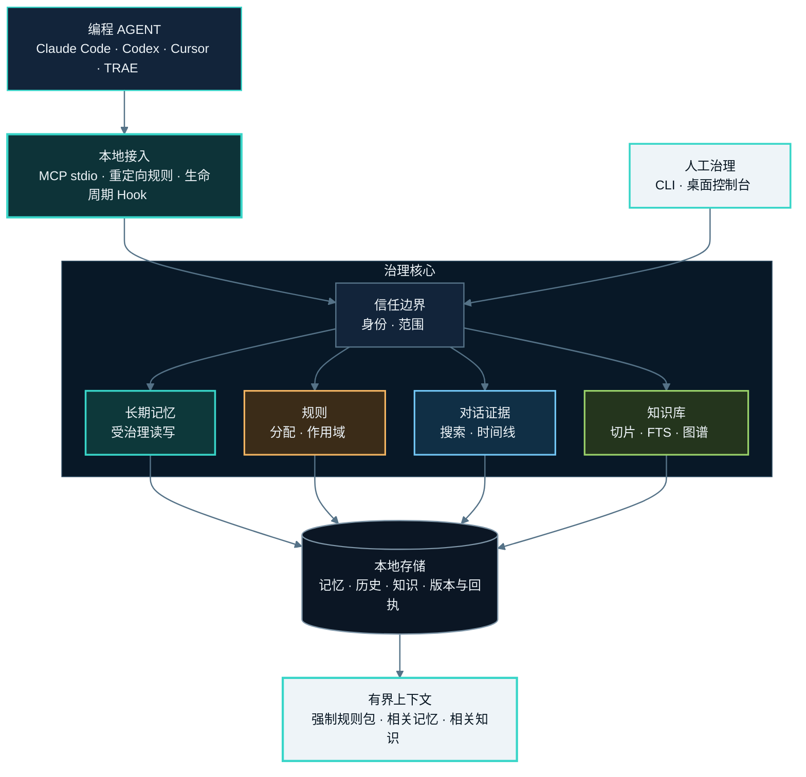

<h1 align="center">MemoryGuard</h1>

<p align="center">
  <strong>面向编程 Agent 的受治理共享记忆。</strong><br />
  本地优先的 MCP 记忆层，提供自动整理、范围规则、证据链和可逆治理。
</p>

<p align="center">
  <a href="https://pypi.org/project/agent-memguard/"></a>
  <a href="https://github.com/irisxc4/memoryguard/actions/workflows/ci.yml"></a>
  <a href="https://github.com/irisxc4/memoryguard/blob/main/pyproject.toml"></a>
  <a href="LICENSE"></a>
  <a href="README.md">English</a>
</p>

> Agent 可以正常写入，MemoryGuard 负责分类、去重、冲突识别、隔离和版本治理。
> 每次变化保留证据，之后仍可修正、恢复或回滚。
>
> **无账号、无远端服务器、无遥测。数据默认留在本地。**

<p align="center">
  <a href="#快速开始">快速开始</a> ·
  <a href="#升级">升级</a> ·
  <a href="#知识库">知识库</a> ·
  <a href="#系统架构">系统架构</a> ·
  <a href="#隐私与安全边界">隐私边界</a>
</p>

<p align="center">
  
</p>

<p align="center">
  <sub>神经图展示受治理投影；原始对话正文不会直接进入图谱或自动注入上下文。</sub>
</p>

## 为什么需要 MemoryGuard

持久化只解决“存下来”，没有解决“以后还能不能可靠复用”。

| 没有治理 | 使用 MemoryGuard |
|---|---|
| 笔记持续堆积，没有规范状态 | 写入会被分类、去重、覆盖或标记冲突 |
| 纠错直接覆盖旧值 | 证据和 supersede 链保留变化原因 |
| Token、凭证可能继续活跃 | 敏感内容进入隔离区，不参与活跃召回 |
| 每条写入都要人工审批 | Agent 正常工作，人只治理异常和结果 |
| 原始聊天自动混入未来上下文 | 对话历史独立保存，只能显式读取 |

## 系统架构



## 快速开始

### 1. 安装

```bash
python -m pip install agent-memguard
```

需要桌面治理台：

```bash
python -m pip install "agent-memguard[gui]"
```

### 2. 授权当前项目

```bash
memoryguard source add .
```

### 3. 连接编程 Agent

```bash
# Claude Code
python -m memoryguard.provider_adapters install claude

# Codex
python -m memoryguard.provider_adapters install codex

# Cursor
python -m memoryguard.provider_adapters install cursor
```

重启宿主后验证：

```bash
memoryguard doctor
memoryguard mcp-status
memoryguard hooks status --provider all
```

启动桌面治理台：

```bash
memoryguard gui .
```

`memoryguard-gui .` 仍可用于桌面快捷方式。PowerShell 和其他终端推荐使用
`memoryguard gui .`，这样启动失败时可以直接看到错误信息。

详细说明：[Claude Code](docs/install-claude-code.md) ·
[Codex](docs/install-codex.md) · [Cursor](docs/install-cursor.md)

## 升级

当前版本通过 Python 包管理器升级：

```bash
python -m pip install --upgrade agent-memguard
memoryguard --version
memoryguard doctor
```

安装过 GUI extra 时：

```bash
python -m pip install --upgrade "agent-memguard[gui]"
```

目前**没有**独立的 `memoryguard update` 自更新命令。包管理器是正式升级入口；
新版本打开本地存储时会执行对应 Schema 迁移。

## 知识库

桌面治理台可以把你选择的文件夹统一加入本地知识库。源文件保持原位，MemoryGuard
把检索索引写入用户数据目录，不会给每个被选中的资料项目复制一套知识库数据库。

| 能力 | 当前行为 |
|---|---|
| 文件夹入库 | 一个文件夹作为一本书，支持文件作为文档进入索引 |
| 结构化处理 | 解析文档、保留章节/小节上下文、生成可追溯切片 |
| 检索 | 全文检索、可选 Embedding、分层知识图谱 |
| 自然同步 | 重新整理变更文件；部分扫描或失败不会误删以前已索引内容 |
| 删除治理 | 移入知识库回收站、恢复，或明确永久清理恢复快照 |
| 记忆候选 | 先预览带来源证据的候选，确认后才写入长期记忆 |

从桌面治理台进入**知识库**。远程 Embedding 或模型索引必须显式授权；未授权时，
本地全文检索仍可使用，不会把资料正文发送给远程 Provider。

## 规则、历史与知识分层

| 数据面 | 用途 | 上下文行为 |
|---|---|---|
| **长期记忆与规则** | 偏好、流程、纠错、事实、项目和范围化强制规则 | 强制规则使用独立有界预算；普通记录按任务相关性召回 |
| **对话历史** | 带 owner 和共享组权限的本地原文证据 | 永不自动进入 bootstrap，只能经历史工具显式读取 |
| **知识库** | 用户选择的文档资料、切片和派生索引 | 仅返回有界相关片段；候选不会静默变成长时记忆 |
| **神经图** | 导航记忆、规则、项目、Agent、会话和知识投影 | 展示安全元数据和摘要，不展示原始聊天正文 |

历史读取采用“搜索结果 → 有界时间线 → 指定 Turn/会话”的渐进路径。历史萃取先
生成预览，再经明确接受进入正常治理写入。

## 可治理内容

| 信号 | 治理动作 |
|---|---|
| 重复或过期记忆 | 查看规范记录和覆盖链，必要时恢复旧版本 |
| 相互冲突的记忆 | 同时保留两侧，直到明确裁决 |
| Secret、Token 或凭证 | 隔离，不进入活跃共享记忆 |
| 自动整理错误 | 修正、合并、锁定、恢复或按证据回滚 |
| 多个编程 Agent | 绑定到同一共享组，同时保留来源身份和作用域 |
| 强制规则 | 分配给 Agent、项目、Provider、运行角色或共享组 |

治理台不是审批队列。Agent 不必等待；人可以在需要时根据证据治理结果。

## 支持的宿主

| 宿主 | 接入方式 | 当前边界 |
|---|---|---|
| Claude Code | 全局 MCP、重定向规则、用户级 Hook | 已验证接管路径 |
| Codex | 全局 MCP、重定向规则、用户级 Hook | 已验证接管路径 |
| Cursor | 全局 MCP、重定向规则、用户级 Hook | 已验证接管路径 |
| TRAE | MCP 与重定向规则 | 未验证可靠 Hook seam，按降级能力报告 |

MemoryGuard 会如实报告 redirected、observed、operational 或 unsupported，
不会在宿主没有可靠接入点时声称已关闭其原生记忆。

## 隐私与安全边界

- MemoryGuard 以本地 MCP stdio 服务运行。
- 除非你明确授权远程模型或 Embedding 操作，受治理数据不会离开本机。
- 知识库数据库位于 `MEMORYGUARD_HOME` 或平台用户数据目录；被选中的源文件夹不会
  获得一套独立知识库数据库。
- 当前版本部分共享记忆、对话历史、审计和恢复产物仍位于授权工作区的
  `.memoryguard/`。因此数据是本地的，但尚未全部集中到统一数据目录。
- 来源扫描默认只读；变更路径带有校验、明确作用域、来源证据和可逆状态。
- 隔离记录不会进入活跃共享记忆。
- 原始对话历史永不自动注入 bootstrap。
- 共享组历史读取按当前活跃成员关系授权，且不授予删除其他 Agent 来源的权限。

## CLI

| 命令 | 说明 |
|---|---|
| `audit [path]` | 只读审计并生成报告 |
| `open [path]` | 打开最新交互报告 |
| `explain <finding_id>` | 解释发现项的证据和风险 |
| `plan <finding_ids...>` | 生成不写入的最小修复计划 |
| `apply <plan_id>` | 备份后应用计划并重新扫描 |
| `verify` | 比较变更前后工作区 |
| `undo <change_id>` | 从备份恢复并验证 |
| `source <action>` | 管理授权来源 |
| `scan` | 扫描授权来源并生成覆盖账本 |
| `import <action> <bundle>` | 预览或创建离线导入包 |
| `doctor` | 诊断安装和集成状态 |
| `mcp-status` | 查看本地共享记忆组 |
| `hooks <action>` | 安装、检查、暂停、修复或移除宿主 Hook |
| `gc [path]` | 预览或执行可重建产物清理 |
| `gui [path]` | 启动交互式治理台 |
| `desktop` | 启动可信桌面执行器 |

以 `memoryguard --help` 和 `memoryguard <command> --help` 为当前安装版本的命令真相源。

## MCP API

MCP 服务提供：

- 长期记忆读、搜索、写、更新、删除和状态查询；
- 强制规则隔离预算与有界上下文 bootstrap；
- 规则创建、反馈、合并治理、撤销和作用域统计；
- Agent 绑定与共享组检查；
- 来源扫描、神经图投影、导入预览和构建规划；
- 文档提取预览、候选接受和知识检索；
- 对话历史搜索、时间线、显式读取、导出、删除和萃取预览；
- Provider 安装和宿主 Agent 信息补全。

精确工具列表以 MCP `tools/list` 为准。

## 项目链接

- [PyPI 包](https://pypi.org/project/agent-memguard/)
- [GitHub Releases](https://github.com/irisxc4/memoryguard/releases)
- [长期记忆连续性与无损控体积 Spec](docs/memory-continuity-storage-spec-v1.md)
- [贡献指南](CONTRIBUTING.md)
- [贡献者许可协议](CLA.md)
- [Issue](https://github.com/irisxc4/memoryguard/issues)

## 路线图

- **当前：** 本地 MCP 记忆、自动整理、范围规则、对话证据、知识库、Provider
  适配器、治理 UI 和回滚。
- **下一步：** 内容寻址去重、自然来源同步、Delta/Checkpoint 存储、派生索引维护和
  更清晰的治理报告。长期记录不会仅仅因为存在时间长而被淘汰。
- **以后：** 只在需求被验证后扩展团队和企业能力。

详细设计见[长期记忆连续性与无损控体积 Spec](docs/memory-continuity-storage-spec-v1.md)。
其中 Content Plane、Delta/Checkpoint 等属于拟议架构，不代表当前版本已经实现。

## 贡献

欢迎提交 Issue 和 PR。请先阅读 [CONTRIBUTING.md](CONTRIBUTING.md)；提交 PR 即表示
同意 [CLA](CLA.md)。

## 许可证

[MIT](LICENSE)
