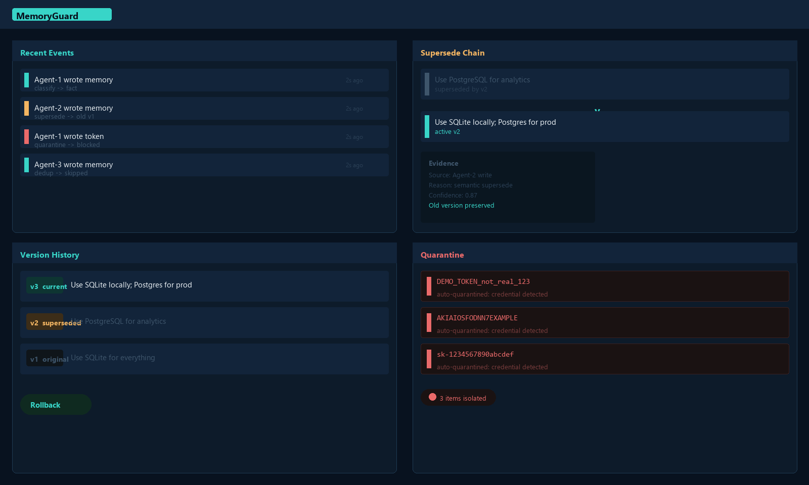
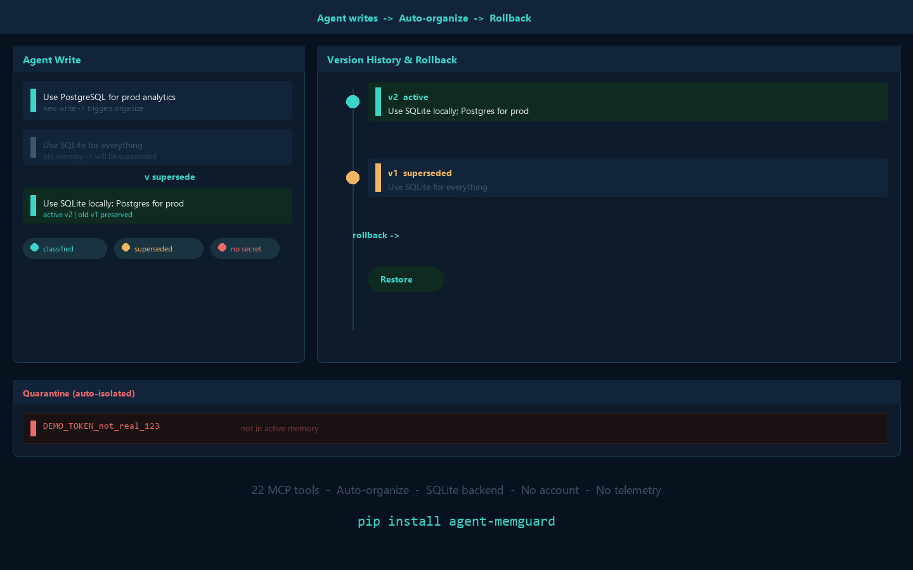

<p align="center">
  
</p>

<h1 align="center">MemoryGuard</h1>

<p align="center">
  <strong>多个编程 Agent 共享记忆，不共享混乱。</strong><br />
  本地优先的 MCP 记忆层：写入自动整理，每一次治理决策都可追溯、可修正、可回滚。
</p>

<p align="center">
  <a href="https://pypi.org/project/agent-memguard/"></a>
  <a href="https://github.com/irisxc4/memoryguard/blob/main/pyproject.toml"></a>
  <a href="LICENSE"></a>
  <a href="README.md">English</a>
</p>

> Agent 可以自由写入。MemoryGuard 会在每次写入时自动分类、去重、覆盖、隔离和压缩；之后你仍可查看证据、修正结果或回滚治理决策。
>
> **无账号、无服务器、无遥测。你的记忆始终留在本地。**

<p align="center">
  <a href="#60-秒安装">60 秒安装</a> ·
  <a href="#看看治理闭环">看看治理闭环</a> ·
  <a href="#它是什么也不是什么">它是什么，也不是什么</a>
</p>

## 为什么需要 MemoryGuard

持久记忆只解决了一半问题。多个编程 Agent 往同一上下文写入时，记忆会逐渐重复、过期、冲突，甚至混入不应复用的敏感内容。

MemoryGuard 是本地的控制层，位于编程 Agent 与其共享记忆之间：

| 不再是 | 而是 |
|---|---|
| 不断堆积、无人整理的笔记 | 写入时自动分类、去重、覆盖、冲突检测、隔离、衍生和压缩 |
| 人工审批每一条 Agent 写入 | Agent 自动写；只在需要时人工治理结果 |
| 一次覆盖就永久丢失旧信息 | 保留历史、证据、覆盖链和回滚能力 |
| 把项目上下文交给另一项在线服务 | 本地 MCP stdio 服务与本地 SQLite 存储 |

## 看看治理闭环

<p align="center">
  
</p>

```text
Agent 写入记忆
  -> MemoryGuard MCP 写入
  -> 自动整理
      分类 · 去重 · 覆盖 · 冲突检测 · 隔离 · 压缩
  -> 活跃共享记忆
  -> 治理台
      查看 · 修正 · 合并 · 锁定 · 恢复 · 回滚
```

治理台**不是审批队列**。Agent 不必停下来等待；你只在真正需要时基于证据治理结果。

## 60 秒安装

```bash
pip install agent-memguard
```

选择你的编程 Agent。以下命令会写入 MCP 配置与对应指令文件：

```bash
# Claude Code
memoryguard source add . && python -m memoryguard.provider_adapters install claude

# Codex
memoryguard source add . && python -m memoryguard.provider_adapters install codex

# Cursor
memoryguard source add . && python -m memoryguard.provider_adapters install cursor
```

重启 Agent 后，验证环境：

```bash
memoryguard doctor
memoryguard mcp-status
```

需要桌面治理窗口时：

```bash
pip install "agent-memguard[gui]"
```

明确的配置说明与各 Provider 的行为边界见 [Claude Code](docs/install-claude-code.md)、[Codex](docs/install-codex.md) 与 [Cursor](docs/install-cursor.md)。

## 你能治理什么

<p align="center">
  
</p>

| 信号 | 你可以做什么 |
|---|---|
| 重复或过期记忆 | 查看覆盖链；需要时恢复旧版本 |
| 相互冲突的记忆 | 暴露冲突，再有意识地裁决 |
| Secret、Token 或凭证 | 隔离，而不是继续放在活跃共享记忆中 |
| 错误的治理决定 | 查看历史，并把共享记忆回滚到版本快照 |
| 多个编程 Agent | 将 Agent 绑定到受治理的共享记忆组 |

## 它是什么，也不是什么

MemoryGuard 是面向编程 Agent 的**本地 MCP 记忆后端与治理台**。它提供共享事实源，并在写入发生时整理记忆。

它不是云服务、账号体系，也不是阻塞每次写入的人工关卡。它同样不会假装所有 Agent 的原生记忆都能被关闭：Provider 支持状态会按 redirected、observed 或 unsupported 如实报告。

## 架构

| 层 | 职责 |
|---|---|
| **证据层** | Agent 原生记忆、文件、文档与外部 MCP 描述符；只提供原始输入，不是治理事实源 |
| **记忆层** | MemoryGuard 本地 MCP 共享记忆后端；受治理的共享事实源 |
| **治理层** | GUI 与 CLI；用于观察、查看证据、修正和可逆变更 |

## 核心能力入口

| 入口 | 适合做什么 |
|---|---|
| MCP 记忆后端 | 读取、搜索、写入、更新、删除及查询共享记忆状态 |
| 自动整理器 | 写入时分类、去重、覆盖、发现冲突、隔离、衍生和压缩 |
| 治理台 | 查看原始写入、冲突、隔离、覆盖链和版本 |
| Provider 适配器 | 一条命令配置 Claude Code、Codex 或 Cursor |
| CLI | 审计本地来源、管理授权输入、查看报告和执行记忆构建/发布流程 |

完整 MCP 工具和 CLI 命令置于下方，供评估与集成时查阅。

<details>
<summary><strong>CLI 命令</strong></summary>

| 命令 | 说明 |
|---|---|
| `audit [path]` | 只读扫描并生成报告 |
| `open [path]` | 在窗口中打开最新报告 |
| `explain <finding_id>` | 解释发现项的证据与风险 |
| `plan <finding_ids...>` | 生成不写入的最小修复计划 |
| `apply <plan_id>` | 应用计划：备份、修补、重扫 |
| `verify` | 重扫并比较前后结果 |
| `undo <change_id>` | 从备份恢复并再次验证 |
| `source <action>` | 管理授权来源 |
| `scan` | 只读扫描并构建覆盖率账本 |
| `import <action> <bundle>` | 预览或创建离线导入包 |
| `memory <action>` | 记忆构建、验证与发布回滚流程 |
| `doctor` | 诊断安装与环境 |
| `mcp-status` | 查看 MCP 共享记忆状态 |

</details>

<details>
<summary><strong>MCP 工具</strong></summary>

| 分组 | 工具 |
|---|---|
| 记忆后端 | `memoryguard_memory_read`、`memoryguard_memory_search`、`memoryguard_memory_write`、`memoryguard_memory_update`、`memoryguard_memory_delete`、`memoryguard_memory_status` |
| 审计与扫描 | `memoryguard_audit`、`memoryguard_explain`、`memoryguard_list_sources`、`memoryguard_scan_summary`、`memoryguard_neuron_graph`、`memoryguard_import_preview`、`memoryguard_build_plan` |
| Agent 绑定 | `memoryguard_binding_create`、`memoryguard_binding_list` |
| 外部 MCP | `memoryguard_external_mcp_list`、`memoryguard_external_mcp_import` |
| 文档提取 | `memoryguard_extract_memories`、`memoryguard_accept_candidates` |
| 语义与 Provider | `memoryguard_semantic_check`、`memoryguard_provider_install` |

</details>

## 隐私与安全边界

- MemoryGuard 以本地 MCP stdio 服务运行；不需要账号、远端服务器或遥测。
- 共享记忆保存在 `.memoryguard/` 下的本地 SQLite 中。
- 来源扫描默认只读；变更经由显式计划、备份、重扫与撤销路径完成。
- 被隔离的记忆不会进入活跃共享记忆，直到你决定如何处理。

## 路线图

- **现在：** 本地 MCP 后端、自动整理、治理台、Provider 适配器与回滚。
- **之后：** 衰减、衍生记忆、治理报告等增强信号；不承诺具体日期。
- **之后：** 在需求被验证后探索团队与企业能力；不承诺具体日期。

## 贡献

欢迎提交 Issue 和 PR。请先阅读 [CONTRIBUTING.md](CONTRIBUTING.md)；提交 PR 即表示同意 [CLA](CLA.md)。

## 许可证

[MIT](LICENSE)
