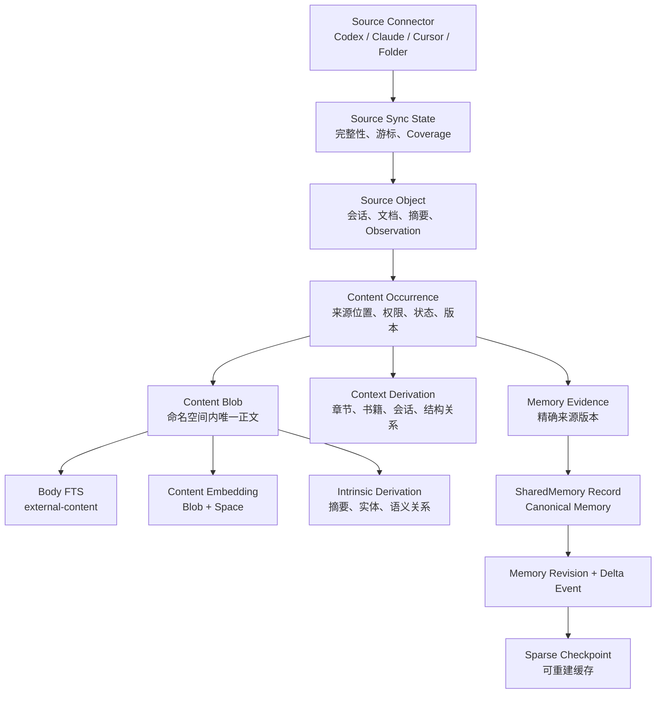

# MemoryGuard 长期记忆连续性与无损控体积 Spec v1

## 文档信息

| 字段 | 内容 |
| --- | --- |
| 状态 | Proposed |
| 版本 | 1.0 |
| 日期 | 2026-08-06 |
| 代码基线 | `main@e8ab698` |
| 知识库验收基线 | `ecf3f4b` |
| 目标读者 | 产品、架构、存储、检索、治理、测试 |
| 实施前提 | 不改变长期记忆产品哲学，不降低权限隔离和检索质量 |

## 1. 结论

本项目需要解决的不是“数据太久”，而是“同一逻辑内容被重复保存和重复派生”。

目标状态：

```text
来源内容长期存在
        ↓
在同一隐私域内按规范化正文精确去重
        ↓
Occurrence 保存来源、位置、权限和生命周期
        ↓
FTS / Embedding / KAG 只保存可重建派生数据
        ↓
Canonical Memory 保存治理后的长期事实
        ↓
Evidence 和 Revision 保存来源与演化
        ↓
磁盘主要随唯一内容和真实变更增长
```

本 Spec 作出八项核心决策：

1. 对话和长期记忆不按年龄、数量、容量或召回频率自动删除。
2. 原始来源的删除权属于来源 Agent 或用户，MemoryGuard 只同步来源真相。
3. 正文去重必须限制在兼容的隐私与治理命名空间内，禁止跨权限域盲目复用。
4. 对话和知识正文进入统一 Content Plane；治理数据库继续保持独立。
5. FTS 使用 external-content，但保留当前中文与非中文检索能力，不强制单一 tokenizer。
6. Embedding、FTS、自动摘要和模型抽取按派生版本治理，可重建、可切换、可清理。
7. SharedMemory 保留现有 `records`、ID、治理语义和 API，完整快照逐步改为 Revision + Delta + 稀疏 Checkpoint。
8. 所有迁移采用 outbox、双写、影子读和摘要校验，不直接一次性替换事实源。

## 2. 用户问题

### 2.1 当前用户痛点

| 问题 | 用户影响 |
| --- | --- |
| 同一对话正文同时进入业务表和 FTS | 长期使用后数据库膨胀，用户误以为必须删除旧对话 |
| 相同 Chunk 按出现次数生成向量 | 模型切换或重复资料会重复消耗空间和调用成本 |
| 删除书籍复制整套派生索引 | 删除操作本身制造大量重复数据 |
| SharedMemory 每个版本复制完整状态 | 版本数量随操作次数线性放大整库体积 |
| 工作区内存在重型运行数据库和操作目录 | 项目目录被 MemoryGuard 运行状态污染 |
| 当前会话存在总 Turn 上限 | 安全预算被实现成逻辑历史上限，不符合长期记忆目标 |

### 2.2 期望结果

用户可以持续积累对话、知识和长期记忆，不需要为了控制体积手工删除旧历史。重复内容只承担轻量来源映射成本；来源暂时不可读时不丢索引；来源确认删除时自然退出活跃检索；长期记忆继续由证据、冲突和修订治理。

## 3. 当前代码事实

以下内容来自当前 `main`，是实施和验收基线。

| 当前事实 | 证据 |
| --- | --- |
| 对话正文存于 `conversation_turns.content` | `src/memoryguard/conversation_history.py:320` |
| `history_fts` 再保存 `title` 和 `content` | `src/memoryguard/conversation_history.py:359` |
| 知识正文存于 `chunks.text` | `src/memoryguard/knowledge_store.py:48` |
| `chunks_fts` 再索引 `chapter/section/text`，使用 trigram | `src/memoryguard/knowledge_store.py:188` |
| Embedding 主键是 `(chunk_id, embedding_space_id)` | `src/memoryguard/knowledge_store.py:123` |
| 删除书籍快照包含 Chunk、Embedding、实体、关系、候选和 Job | `src/memoryguard/knowledge_store.py:427` |
| Embedding BLOB 会转 Base64 写入 `snapshot_json` | `src/memoryguard/knowledge_store.py:403` |
| SharedMemory `versions.snapshot` 保存 11 类完整状态 | `src/memoryguard/shared_memory_store.py:5065` |
| SharedMemory 的 `records_fts` 已采用 external-content | `src/memoryguard/shared_memory_store.py:243` |
| 规则生命周期已有事务 outbox，可作为迁移范式 | `src/memoryguard/shared_memory_store.py:323` |
| 知识扫描已区分完整、部分、暂时不可读和策略跳过 | `src/memoryguard/knowledge_ingestion.py:61` |
| 通用来源扫描已有 Coverage Ledger | `src/memoryguard/source_registry.py:607` |
| 知识库已使用 `MEMORYGUARD_HOME`，但对话和 SharedMemory 仍在项目目录 | `src/memoryguard/data_home.py:28`、`src/memoryguard/conversation_history.py:267`、`src/memoryguard/shared_memory_store.py:518` |
| 会话总 Turn 上限为 10,000，单次导入总字符上限为 20,000,000 | `src/memoryguard/conversation_history.py:21` |

### 3.1 实施假设

| ID | 假设 | 处理 |
| --- | --- | --- |
| ASM-01 | v1 仍是本地单用户数据平面 | Namespace 仍按 Workspace、Agent、Share Group 和敏感级别隔离 |
| ASM-02 | SQLite 运行环境继续提供 FTS5、`unicode61` 和 `trigram` | CI 增加能力探测，缺失时阻止 V2 切换 |
| ASM-03 | 来源 Agent 的稳定事件 ID 并非总是可用 | 无稳定 ID 时保留每次事件，不按正文做事件级去重 |
| ASM-04 | 当前数据库没有统一透明加密层 | 本 Spec 不声称新增静态加密；权限和文件系统保护维持现状 |
| ASM-05 | MCP、GUI、CLI 的公开语义必须兼容 | Store Facade 和双栈迁移承担兼容 |
| ASM-06 | 用户允许短暂维护锁，但不接受静默丢数据 | 深度压缩和最终切换必须显式、可取消、可回退 |

## 4. 产品边界与不可变规则

### 4.1 不可变规则

| ID | 规则 |
| --- | --- |
| INV-01 | 长期记忆和有效对话不因年龄、数量、容量或未召回而自动删除 |
| INV-02 | MemoryGuard 不主动删除来源 Agent 的原始对话 |
| INV-03 | 只有来源完整同步才能把“未出现”解释为“来源删除” |
| INV-04 | 部分、失败或不可读同步不得停用未扫描到的旧来源 |
| INV-05 | 用户确认的记忆、规则证据、修订历史和治理决策不得作为缓存清理 |
| INV-06 | FTS、Embedding、模型摘要、自动实体关系和 Checkpoint 是派生数据 |
| INV-07 | 相同正文只在同一 Content Namespace 内物理去重 |
| INV-08 | 查询必须先完成 Occurrence 权限过滤，再读取正文或生成可见摘要 |
| INV-09 | 重复同步、重放事件和失败重试必须幂等 |
| INV-10 | 任何硬删除前必须完成引用审计，失败时保留数据 |

### 4.2 数据分类与删除权

| 数据类型 | 事实源 | 删除触发者 | 可否自动清理 | 说明 |
| --- | --- | --- | --- | --- |
| Agent 对话 | 来源 Agent | 来源完整同步确认删除 | 否 | 暂时不可读必须保留 |
| 知识源文件 | 用户文件系统 | 用户或文件系统 | 否 | MemoryGuard 不删除源文件 |
| Content Blob | MemoryGuard 内容平面 | 引用归零并通过安全扫描 | 是 | 仅删除无来源、无 Evidence、无回收站 Hold 的 Blob |
| Canonical Memory | SharedMemory | 用户或治理显式操作 | 否 | 不按时间、容量淘汰 |
| Evidence | 治理系统 | 来源变化只改变状态 | 否 | 保留审计链 |
| Memory Revision | 治理系统 | 不删除 | 否 | 永久保留逻辑演化 |
| FTS | Content Plane | 索引版本切换 | 是 | 可重建 |
| Embedding | Content Plane | 空间切换和引用归零 | 是 | 不属于长期记忆 |
| 自动 KAG 派生 | Content Plane | 提取器版本切换 | 是 | 可重建 |
| Checkpoint | 版本系统 | 稀疏策略替换 | 是 | Delta 才是历史事实 |
| 临时任务和 WAL | 运行时 | 任务完成或维护操作 | 是 | 不承载逻辑历史 |

### 4.3 非目标

1. 不做基于 TTL 的对话、记忆或 Evidence 删除。
2. 不做跨用户、跨加密域或跨不兼容权限域的全局正文去重。
3. 不做语义近似正文合并。Blob 层只做规范化后的精确内容去重。
4. 不把所有治理、规则、内容和运行状态合并进一个超级数据库。
5. v1 不默认启用 float16 向量，必须先通过检索质量门禁。
6. 不改变现有 MCP、GUI 和 CLI 的用户可见语义。

## 5. 目标架构



### 5.1 数据库边界

目标目录：

```text
MEMORYGUARD_HOME/
├── content/
│   └── content.db
├── workspaces/
│   └── <workspace-id>/
│       ├── governance.db
│       └── shared-memory/
│           └── <group-id>/
│               └── memory.db
└── temp/
    └── <process-or-job-id>/
```

项目目录只保存本地工作区指针：

```text
<project>/.memoryguard/workspace.json
```

`content.db` 只承载内容事实域：

- Source Connector 和同步状态；
- Source Object；
- Content Blob 和 Occurrence；
- FTS；
- Embedding；
- 内容派生和删除 Hold。

治理和规则继续保存在工作区与 Share Group 数据库。该边界避免超级数据库，同时让 external-content FTS、Occurrence 权限和 Blob 引用处于同一事务域。

### 5.2 Workspace Pointer

```json
{
  "schema_version": 1,
  "workspace_id": "ws-...",
  "data_home_profile": "default"
}
```

约束：

- 不包含 Secret、Token 或绝对数据目录；
- 默认是本机文件，不作为跨用户共享身份；
- 项目移动后 `workspace_id` 不变；
- 指针丢失时不得猜测关联旧数据，必须创建新 Workspace 或由用户显式重新关联。

## 6. Content Namespace 与精确去重

### 6.1 为什么不能全局按 SHA 去重

同一正文可能同时存在于：

- 私有 Agent 对话；
- 共享知识书籍；
- 控制面指令；
- 敏感文件；
- 不同 Share Group。

若直接使用全局 `sha256(text)` 作为唯一键，会形成跨权限域的生命周期耦合，并增加存在性侧信道和误清理风险。

### 6.2 Namespace 定义

`namespace_id` 必须至少包含：

```text
本地 Owner
+ Workspace / Share Boundary
+ Sensitivity Class
+ Retention Authority
+ Canonicalization Version
```

默认失败封闭：

- 权限或敏感级别不兼容时，不共享 Blob；
- 明确证明属于同一信任域后，才允许跨 Agent 或跨书籍复用；
- Namespace 只决定物理复用，不授予读取权限。

默认映射：

| 内容来源 | 默认 Namespace 边界 |
| --- | --- |
| 私有对话 | Workspace + Agent + Project + Sensitivity |
| Share Group 对话 | Workspace + Share Group + Sensitivity |
| 普通知识书籍 | Workspace + Knowledge Policy Class + Sensitivity |
| 控制面内容 | Workspace + Control Surface + Sensitivity |
| 用户显式公共知识 | Local Owner + Explicit Public Knowledge + Sensitivity |

跨 Agent 复用必须满足同一 Share Group 或同一显式公共知识策略。仅仅因为两个 Agent 位于同一台机器，不足以共享 Blob。

### 6.3 正文规范化

Blob 去重是精确去重，不是语义合并。

规范化只允许：

1. UTF-8 严格解码；
2. 换行统一为 `\n`；
3. Unicode NFC；
4. 使用 Source Adapter 已确定的逻辑正文；
5. 记录 `normalizer_id` 和 `normalizer_version`。

禁止：

- 自动小写；
- 删除内部空白；
- 移除标点；
- 语言翻译；
- 摘要替换正文；
- 相似度阈值合并。

### 6.4 表结构

```sql
CREATE TABLE content_namespaces (
    namespace_id TEXT PRIMARY KEY,
    workspace_id TEXT NOT NULL,
    trust_domain TEXT NOT NULL,
    sensitivity TEXT NOT NULL,
    retention_authority TEXT NOT NULL,
    canonicalization_version INTEGER NOT NULL,
    created_at TEXT NOT NULL,
    UNIQUE (
        workspace_id,
        trust_domain,
        sensitivity,
        retention_authority,
        canonicalization_version
    )
);

CREATE TABLE content_blobs (
    blob_id TEXT PRIMARY KEY,
    namespace_id TEXT NOT NULL,
    canonical_hash TEXT NOT NULL,
    normalizer_id TEXT NOT NULL,
    text TEXT NOT NULL,
    byte_count INTEGER NOT NULL,
    char_count INTEGER NOT NULL,
    language_hint TEXT NOT NULL DEFAULT '',
    created_at TEXT NOT NULL,
    UNIQUE (namespace_id, normalizer_id, canonical_hash),
    FOREIGN KEY (namespace_id) REFERENCES content_namespaces(namespace_id)
);
```

`blob_id` 可以由 Namespace、Normalizer 和完整 SHA-256 确定性生成，但不得通过公共 API 暴露为内容存在性查询接口。

## 7. Source Object 与 Occurrence

### 7.1 设计目的

Blob 只描述“正文是什么”。Occurrence 描述：

- 正文来自哪里；
- 位于什么位置；
- 谁可以读取；
- 当前是否仍在来源中；
- 哪次完整同步确认了删除；
- 哪个版本被 Evidence 引用。

### 7.2 表结构

```sql
CREATE TABLE source_connectors (
    source_id TEXT PRIMARY KEY,
    workspace_id TEXT NOT NULL,
    provider TEXT NOT NULL,
    source_type TEXT NOT NULL,
    external_root_key TEXT NOT NULL,
    enabled INTEGER NOT NULL DEFAULT 1,
    created_at TEXT NOT NULL,
    updated_at TEXT NOT NULL,
    UNIQUE (workspace_id, provider, source_type, external_root_key)
);

CREATE TABLE source_objects (
    source_object_id TEXT PRIMARY KEY,
    source_id TEXT NOT NULL,
    object_type TEXT NOT NULL,
    external_object_key TEXT NOT NULL,
    parent_object_id TEXT NOT NULL DEFAULT '',
    title TEXT NOT NULL DEFAULT '',
    metadata_json TEXT NOT NULL DEFAULT '{}',
    active INTEGER NOT NULL DEFAULT 1,
    first_seen_at TEXT NOT NULL,
    last_seen_at TEXT NOT NULL,
    deleted_scan_id TEXT NOT NULL DEFAULT '',
    UNIQUE (source_id, external_object_key),
    FOREIGN KEY (source_id) REFERENCES source_connectors(source_id)
);

CREATE TABLE content_occurrences (
    occurrence_id TEXT PRIMARY KEY,
    source_object_id TEXT NOT NULL,
    occurrence_key TEXT NOT NULL,
    blob_id TEXT NOT NULL,
    source_revision TEXT NOT NULL DEFAULT '',
    ordinal INTEGER NOT NULL DEFAULT 0,
    locator_json TEXT NOT NULL DEFAULT '{}',
    content_role TEXT NOT NULL DEFAULT 'knowledge',
    sensitivity TEXT NOT NULL DEFAULT 'normal',
    workspace_id TEXT NOT NULL,
    agent_instance_id TEXT NOT NULL DEFAULT '',
    project_ref TEXT NOT NULL DEFAULT '',
    share_group_id TEXT NOT NULL DEFAULT '',
    policy_class TEXT NOT NULL DEFAULT 'private',
    access_scope_json TEXT NOT NULL DEFAULT '{}',
    active INTEGER NOT NULL DEFAULT 1,
    first_seen_at TEXT NOT NULL,
    last_seen_at TEXT NOT NULL,
    deleted_scan_id TEXT NOT NULL DEFAULT '',
    UNIQUE (source_object_id, occurrence_key),
    FOREIGN KEY (source_object_id) REFERENCES source_objects(source_object_id),
    FOREIGN KEY (blob_id) REFERENCES content_blobs(blob_id)
);

CREATE INDEX idx_occurrences_scope
    ON content_occurrences (
        workspace_id,
        agent_instance_id,
        project_ref,
        share_group_id,
        policy_class,
        active
    );
```

权限过滤必须使用结构化列作为主查询条件。`access_scope_json` 只承载向后兼容或未来扩展字段，不能作为唯一权限真相。

### 7.3 稳定身份

| 来源 | `source_object_id` | `occurrence_key` |
| --- | --- | --- |
| Agent 对话 | Provider + Agent + Project + Session | 稳定 Event ID；没有稳定 ID 时生成唯一 Capture ID |
| Markdown 文档 | Book + Relative Path | Chunker Version + Heading Path + Ordinal |
| 会话摘要 | Session | `summary:<summary_kind>` |
| Observation | Session | 稳定 Observation ID |

内容变化时保持 `occurrence_id`，只更新 `blob_id` 和 `source_revision`。Evidence 必须同时保存当时的 `blob_id`，避免来源后续修改导致证据漂移。

## 8. 自然同步与完整性状态机

### 8.1 同步状态

```text
idle
  → scanning
  → applying
  → complete

scanning / applying
  → partial
  → failed

partial / failed
  → scanning
```

#### 8.1.1 持久同步账本

无变化同步不能每次追加一套永久 Run 记录。持久状态采用“当前状态 + 当前 Manifest + 去重异常”：

```sql
CREATE TABLE source_sync_state (
    source_id TEXT PRIMARY KEY,
    active_run_id TEXT NOT NULL DEFAULT '',
    state TEXT NOT NULL DEFAULT 'idle',
    cursor TEXT NOT NULL DEFAULT '',
    last_complete_scan_id TEXT NOT NULL DEFAULT '',
    manifest_digest TEXT NOT NULL DEFAULT '',
    coverage_digest TEXT NOT NULL DEFAULT '',
    last_started_at TEXT NOT NULL DEFAULT '',
    last_finished_at TEXT NOT NULL DEFAULT '',
    last_error_code TEXT NOT NULL DEFAULT '',
    revision INTEGER NOT NULL DEFAULT 0,
    FOREIGN KEY (source_id) REFERENCES source_connectors(source_id)
);

CREATE TABLE source_manifest_items (
    source_id TEXT NOT NULL,
    external_object_key TEXT NOT NULL,
    occurrence_key TEXT NOT NULL,
    source_revision TEXT NOT NULL DEFAULT '',
    content_hash TEXT NOT NULL DEFAULT '',
    active INTEGER NOT NULL DEFAULT 1,
    last_complete_scan_id TEXT NOT NULL DEFAULT '',
    PRIMARY KEY (source_id, external_object_key, occurrence_key)
);

CREATE TABLE source_manifest_staging (
    run_id TEXT NOT NULL,
    source_id TEXT NOT NULL,
    external_object_key TEXT NOT NULL,
    occurrence_key TEXT NOT NULL,
    source_revision TEXT NOT NULL DEFAULT '',
    content_hash TEXT NOT NULL DEFAULT '',
    coverage_status TEXT NOT NULL,
    reason TEXT NOT NULL DEFAULT '',
    PRIMARY KEY (run_id, external_object_key, occurrence_key)
);

CREATE TABLE source_sync_anomalies (
    source_id TEXT NOT NULL,
    error_fingerprint TEXT NOT NULL,
    error_code TEXT NOT NULL,
    detail TEXT NOT NULL DEFAULT '',
    first_seen_at TEXT NOT NULL,
    last_seen_at TEXT NOT NULL,
    occurrence_count INTEGER NOT NULL DEFAULT 1,
    resolved_at TEXT NOT NULL DEFAULT '',
    PRIMARY KEY (source_id, error_fingerprint)
);
```

规则：

- `source_manifest_staging` 是运行态数据，终态后清空；
- 无变化完整同步只更新 `source_sync_state`，不追加内容事件；
- 相同异常 UPSERT `occurrence_count`，不按重试次数无限增长；
- 只有 Manifest 真实变化才更新 Occurrence 或产生逻辑变更事件；
- `revision` 通过 CAS 防止旧 Run 覆盖新 Run。

### 8.2 状态转移

| 当前状态 | 条件 | 下一状态 | 允许副作用 |
| --- | --- | --- | --- |
| `idle` | 启动同步并取得 Source CAS Lock | `scanning` | 建立运行态游标 |
| `scanning` | 所有 Coverage 项已核算 | `applying` | 写入新增和修改 |
| `scanning` | 预算耗尽、权限失败、暂时不可读 | `partial` | 可写入已确认新增/修改，不得删除未见项 |
| `scanning` | 不可恢复错误 | `failed` | 不修改删除状态 |
| `applying` | Manifest 与 Coverage 摘要校验通过 | `complete` | 才能停用未出现项 |
| `applying` | CAS、事务或校验失败 | `failed` | 回滚本次删除决策 |
| `partial/failed` | 后续重试 | `scanning` | 复用或推进游标 |

### 8.3 删除规则

```text
允许来源删除 =
    当前运行是 complete
    AND 对象属于本次完整 Coverage 范围
    AND 对象未出现在本轮 Manifest
    AND 当前运行仍持有 Source CAS Lock
```

禁止：

- 把超时、权限错误或路径暂时不可读解释为删除；
- 使用旧同步运行停用新运行已经恢复的对象；
- 根据最后访问时间删除；
- 根据数据库大小删除。

### 8.4 无总量上限与有界执行

安全预算必须是单批预算，不是逻辑历史上限。

当前 `MAX_SESSION_TURNS=10_000` 需要改为：

```text
单批最大 Turn 数
+ continuation_cursor
+ partial 状态
+ 后续自动续扫
```

保留：

- 单条正文大小上限；
- 单事务字符预算；
- 单次扫描耗时和文件预算；
- 分页返回上限。

取消：

- 单会话永久总 Turn 上限；
- 单来源永久总字符上限。

## 9. FTS 设计

### 9.1 不能使用单一 tokenizer 替换现状

当前：

- 对话历史使用 `unicode61`；
- 知识库使用 `trigram`，支持中文子串。

直接统一成一个 tokenizer 会改变召回行为。目标是正文只存一次，不是索引只能有一套。

### 9.2 目标结构

```sql
CREATE VIRTUAL TABLE content_fts_unicode USING fts5(
    text,
    content='content_blobs',
    content_rowid='rowid',
    tokenize='unicode61'
);

CREATE VIRTUAL TABLE content_fts_trigram USING fts5(
    text,
    content='content_blobs',
    content_rowid='rowid',
    tokenize='trigram'
);
```

说明：

- 两套索引共享 `content_blobs.text`，不复制业务正文；
- v1 迁移期保留双 Profile；
- 最终是否双索引由 Golden Query 数据决定，不能凭直觉删除；
- 标题、章节、路径等来源上下文进入轻量 `occurrence_meta_fts`，不重复正文。

### 9.3 查询流程

```text
Query
→ Query Planner 选择 unicode / trigram / 双路
→ 得到候选 blob_id 或 occurrence_id
→ JOIN 活跃 Occurrence
→ 应用 Workspace / Agent / Share Group / Sensitivity Policy
→ 过滤后读取正文并生成 snippet
→ 与标题、章节、图谱结果做 RRF
→ 返回来源位置
```

安全要求：

- 未授权 Blob 不得进入可见 snippet；
- FTS 命中不能作为读取权限；
- 同一 Blob 的一个公开 Occurrence 不得暴露另一个私有 Occurrence；
- 搜索计数、分页和总数必须基于授权 Occurrence，不基于全局 Blob 数。

## 10. Embedding Space

### 10.1 表结构

```sql
CREATE TABLE embedding_spaces (
    embedding_space_id TEXT PRIMARY KEY,
    provider_type TEXT NOT NULL,
    model TEXT NOT NULL,
    dimension INTEGER NOT NULL,
    normalizer_version TEXT NOT NULL,
    vector_format TEXT NOT NULL DEFAULT 'float32',
    state TEXT NOT NULL,
    validation_report_json TEXT NOT NULL DEFAULT '{}',
    created_at TEXT NOT NULL,
    activated_at TEXT NOT NULL DEFAULT ''
);

CREATE TABLE content_embeddings (
    blob_id TEXT NOT NULL,
    embedding_space_id TEXT NOT NULL,
    vector BLOB NOT NULL,
    dimension INTEGER NOT NULL,
    text_hash TEXT NOT NULL,
    created_at TEXT NOT NULL,
    PRIMARY KEY (blob_id, embedding_space_id),
    FOREIGN KEY (blob_id) REFERENCES content_blobs(blob_id),
    FOREIGN KEY (embedding_space_id) REFERENCES embedding_spaces(embedding_space_id)
);
```

### 10.2 空间状态机

```text
building → validating → active → superseded → purgeable → purged
                 ↘ failed
```

切换条件：

1. 新空间完整构建；
2. Golden Query Recall@5、MRR 和权限测试通过；
3. 原子切换 Active Space；
4. 所有正在运行的查询和 Job 不再引用旧空间；
5. 旧空间才进入 `purgeable`。

远程 Provider 约束：

- Blob 已存在不等于允许发送给远程 Provider；
- 生成远程 Embedding 必须存在至少一个明确授权的 Occurrence；
- 查询 Embedding 继续使用当前双重授权；
- Embedding 存在不授予任何 Occurrence 读取权限。

float16 仅作为后续可选项。启用前必须证明 Recall@5 和排序质量不下降。

## 11. KAG 与派生内容

### 11.1 Blob 级与 Occurrence 级必须分开

同一正文在不同章节、书籍或会话中可能有不同上下文。不能把所有实体和关系都无条件挂到 Blob。

| 派生类型 | 存储层级 | 示例 |
| --- | --- | --- |
| 正文内在摘要 | Blob | 不依赖标题和章节的简述 |
| 正文内在实体 | Blob | 正文明确出现的名词 |
| 正文内在语义关系 | Blob | 正文明确陈述的关系 |
| 章节/书籍归属 | Occurrence | `belongs_to_chapter` |
| 会话角色关系 | Occurrence | `said_by_user` |
| 文档结构关系 | Occurrence | 前后章节、父标题 |
| 含上下文候选记忆 | Blob + Context Fingerprint | 需要书名、章节或会话上下文 |

### 11.2 派生键

```text
Derivation Key =
    blob_id
    + derivation_kind
    + extractor_version
    + model_space_id
    + context_fingerprint
    + policy_fingerprint
```

正文相同但上下文不同，只复用不依赖上下文的派生结果。

### 11.3 表结构

```sql
CREATE TABLE blob_derivations (
    blob_id TEXT NOT NULL,
    derivation_kind TEXT NOT NULL,
    extractor_version TEXT NOT NULL,
    model_space_id TEXT NOT NULL DEFAULT '',
    context_fingerprint TEXT NOT NULL DEFAULT '',
    policy_fingerprint TEXT NOT NULL DEFAULT '',
    payload_json TEXT NOT NULL,
    status TEXT NOT NULL DEFAULT 'ready',
    created_at TEXT NOT NULL,
    PRIMARY KEY (
        blob_id,
        derivation_kind,
        extractor_version,
        model_space_id,
        context_fingerprint,
        policy_fingerprint
    )
);

CREATE TABLE occurrence_relations (
    relation_id TEXT PRIMARY KEY,
    occurrence_id TEXT NOT NULL,
    subject_entity_id TEXT NOT NULL,
    predicate TEXT NOT NULL,
    object_entity_id TEXT NOT NULL,
    relation_source TEXT NOT NULL,
    extractor_version TEXT NOT NULL,
    created_at TEXT NOT NULL
);
```

实体身份必须包含 Namespace 或明确的实体作用域，不能只按名字跨隐私域合并。

## 12. 知识书籍删除、恢复与永久清理

### 12.1 当前问题

当前 `remove_book()` 把整个书籍索引复制进 `deleted_books.snapshot_json`，Embedding BLOB 还会 Base64 编码。删除一次书籍会复制大量可重建数据。

### 12.2 目标行为

删除改为原位墓碑，不复制索引：

```text
books.status = deleted
documents.status = deleted
occurrences.active = 0
deleted_books 只保存删除元数据
content_holds 保留恢复所需 Blob
FTS / Embedding / 自动 KAG 可移除
```

必须保留：

- 书籍配置；
- 文档与 Occurrence 身份；
- 用户审核过的候选状态；
- 已同步长期记忆的关联；
- 恢复所需 Blob Hold；
- 删除操作者、原因和时间。

可以删除并重建：

- `chunks_fts` 或新 Content FTS 派生；
- Embedding；
- 自动摘要；
- 自动实体和关系；
- Index Job 运行记录。

### 12.3 生命周期

| 当前状态 | 操作 | 下一状态 | 结果 |
| --- | --- | --- | --- |
| `active` | 删除 | `deleted` | 活跃检索移除，Blob 建立 Deletion Hold |
| `deleted` | 恢复 | `restoring` | 恢复配置和 Occurrence，启动派生重建 |
| `restoring` | Lexical 完成 | `active_partial` | FTS 可用，智能索引继续构建 |
| `active_partial` | 全部派生完成 | `active` | 完整恢复 |
| `deleted` | 永久清理 | `purged` | 释放 Hold，删除书籍元数据 |
| 任意运行态 | 并发删除/恢复 | 不变 | CAS 失败，返回当前 Job |

永久清理后，Blob 仍需经过统一引用审计；只要存在其他 Occurrence、Evidence、Revision 或 Hold，就不得硬删除。

## 13. Canonical Memory、Evidence 与 Revision

### 13.1 保留现有事实源

不新建一套平行 `memory_facts` 替代当前 `records`。现有结构已经包含：

- `memory_id`；
- `canonical_hash`；
- `dedup_domain`；
- `supersedes`；
- `provenance`；
- 状态、锁、注入策略和优先级。

目标是在现有 SharedMemory 上补齐规范化 Evidence 和 Revision，不破坏现有治理。

### 13.2 表结构

```sql
CREATE TABLE memory_bodies (
    body_hash TEXT PRIMARY KEY,
    body TEXT NOT NULL,
    char_count INTEGER NOT NULL,
    created_at TEXT NOT NULL
);

CREATE TABLE memory_revisions (
    memory_id TEXT NOT NULL,
    revision INTEGER NOT NULL,
    body_hash TEXT NOT NULL,
    reason TEXT NOT NULL,
    actor TEXT NOT NULL,
    evidence_digest TEXT NOT NULL,
    created_at TEXT NOT NULL,
    PRIMARY KEY (memory_id, revision),
    FOREIGN KEY (body_hash) REFERENCES memory_bodies(body_hash)
);

CREATE TABLE memory_evidence (
    evidence_id TEXT PRIMARY KEY,
    memory_id TEXT NOT NULL,
    occurrence_id TEXT NOT NULL DEFAULT '',
    source_blob_id TEXT NOT NULL DEFAULT '',
    source_revision TEXT NOT NULL DEFAULT '',
    evidence_type TEXT NOT NULL,
    authority TEXT NOT NULL DEFAULT 'observed',
    status TEXT NOT NULL,
    observed_at TEXT NOT NULL,
    invalidated_at TEXT NOT NULL DEFAULT '',
    metadata_json TEXT NOT NULL DEFAULT '{}'
);
```

### 13.3 规则

1. 同一事实重复出现时，优先增加 Evidence，不创建重复顶层 Memory。
2. 语义近似合并仍走现有治理、冲突、证据和人工门禁。
3. 来源修改时，旧 Evidence 固定指向旧 `source_blob_id`，状态变为 `stale` 或 `superseded`。
4. 来源删除时，Evidence 变为 `source_deleted`，Memory 不自动删除。
5. Memory 状态只根据治理规则变为 `active`、`contested`、`unsupported`、`superseded` 或 `deleted`。
6. 只有显式治理删除才能进入 `deleted`，时间和容量不是状态转移条件。
7. 现有 `provenance` JSON 在迁移期作为兼容投影，由 `memory_evidence` 生成。
8. Body 未变化的置信度、绑定或状态更新复用同一 `memory_bodies` 行。
9. 幂等重放或最终状态未变化的请求不创建 Revision 或 Delta。

## 14. SharedMemory 版本系统

### 14.1 当前问题

当前 `create_version_snapshot()` 每次复制：

```text
records
rule_assignments
rule_match_receipts
rule_match_feedbacks
rule_decisions
rule_scope_stats
rule_exceptions
events
decisions
conflicts
quarantine
```

实际是 11 类数据。随着真实变更次数增长，`versions.snapshot` 会重复保存整组状态。

### 14.2 目标模型

```text
每个真实变更
→ 一个事务内写当前状态 + Delta Event + Outbox

必要位置
→ 建立稀疏 Checkpoint

回滚
→ 追加补偿事件形成新 Head
```

### 14.3 表结构

```sql
CREATE TABLE state_change_events (
    sequence INTEGER PRIMARY KEY AUTOINCREMENT,
    event_id TEXT NOT NULL UNIQUE,
    transaction_id TEXT NOT NULL,
    aggregate_type TEXT NOT NULL,
    aggregate_id TEXT NOT NULL,
    operation TEXT NOT NULL,
    before_revision INTEGER NOT NULL DEFAULT 0,
    after_revision INTEGER NOT NULL DEFAULT 0,
    before_ref TEXT NOT NULL DEFAULT '',
    after_ref TEXT NOT NULL DEFAULT '',
    inverse_json TEXT NOT NULL DEFAULT '{}',
    actor TEXT NOT NULL,
    reason TEXT NOT NULL DEFAULT '',
    schema_version INTEGER NOT NULL,
    created_at TEXT NOT NULL
);

CREATE TABLE version_labels (
    version_id TEXT PRIMARY KEY,
    reason TEXT NOT NULL,
    event_sequence INTEGER NOT NULL,
    created_at TEXT NOT NULL
);

CREATE TABLE state_checkpoints (
    checkpoint_id TEXT PRIMARY KEY,
    event_sequence INTEGER NOT NULL,
    state_digest TEXT NOT NULL,
    snapshot_blob BLOB NOT NULL,
    schema_version INTEGER NOT NULL,
    status TEXT NOT NULL,
    created_at TEXT NOT NULL
);
```

`before_ref` 和 `after_ref` 必须引用 Revision、Assignment Revision 或其他结构化状态版本。`inverse_json` 只保存恢复操作和引用 ID，不重复嵌入完整 Memory Body、Evidence 正文或整表状态。

### 14.4 Checkpoint 策略

Checkpoint 是回放缓存，不是事实源。

保留：

```text
最早基线
+ sequence 为 2 的幂的稀疏 Checkpoint
+ 当前最新滚动 Checkpoint
+ 用户显式 Pin 的版本
```

删除 Checkpoint 不影响历史；所有 Delta 永久保留。

### 14.5 回滚语义

旧行为是“恢复快照并切 active 指针”。新行为必须是：

1. 校验目标 Sequence 可完整重放；
2. 计算当前 Head 到目标状态的补偿操作；
3. 在一个事务内应用补偿；
4. 写入新的 Delta Event 和 Decision；
5. 新状态成为最新 Head；
6. 原历史不改写。

### 14.6 迁移旧 Snapshot

1. 保持旧 `versions` 只读可用；
2. 为当前状态建立 Baseline Checkpoint；
3. 新写入切换为 Delta；
4. 逐个导入旧 Version，生成状态摘要和映射；
5. 对每个版本做恢复摘要对比；
6. GUI 同时支持 Legacy Snapshot 和 Delta Version；
7. 全部版本验收通过后，才允许清空旧 `snapshot` 正文；
8. 迁移失败时继续使用旧快照，不影响当前写入。

禁止根据旧快照差异猜测丢失的操作者、原因或证据。无法恢复的历史字段必须明确标为 `legacy_unknown`。

## 15. Blob Hold 与安全 GC

### 15.1 不使用易漂移的手工 Ref Count

Blob 是否可删除必须由引用表查询得出，不以单个可漂移计数为唯一真相。

```sql
CREATE TABLE content_holds (
    hold_id TEXT PRIMARY KEY,
    blob_id TEXT NOT NULL,
    owner_type TEXT NOT NULL,
    owner_id TEXT NOT NULL,
    reason TEXT NOT NULL,
    active INTEGER NOT NULL DEFAULT 1,
    created_at TEXT NOT NULL,
    released_at TEXT NOT NULL DEFAULT '',
    UNIQUE (blob_id, owner_type, owner_id, reason)
);
```

Hold 来源：

- 活跃 Occurrence；
- 已删除书籍回收站；
- Memory Evidence；
- Memory Revision；
- 未完成迁移；
- 正在构建或验证的派生 Job；
- 用户显式 Pin。

### 15.2 Mark-Sweep

```text
Reference Audit Epoch N
→ 标记无引用 Blob 为 candidate
→ 扫描所有注册 Workspace / Share Group 的外部 Hold
→ Reference Audit Epoch N+1 再次确认
→ 同一 candidate 仍无引用
→ 事务删除派生索引
→ 删除 Blob
→ incremental_vacuum
```

这不是 TTL。删除依据是连续两个完整引用审计，不是等待多少天。

失败封闭：

- 任一数据库不可读，整轮不 Sweep；
- 任一 Workspace 清单不完整，整轮不 Sweep；
- 有未消费 outbox，相关 Blob 不 Sweep；
- Candidate 与 Sweep 之间出现新 Hold，CAS 删除失败。

## 16. SQLite 维护

### 16.1 自动维护

在安全点执行：

```sql
PRAGMA wal_checkpoint(PASSIVE);
PRAGMA optimize;
```

对新数据库启用：

```sql
PRAGMA auto_vacuum=INCREMENTAL;
```

清理大量派生数据后：

```sql
PRAGMA incremental_vacuum;
```

### 16.2 主动深度压缩

提供显式维护操作：

```text
memoryguard storage compact
```

流程：

```text
取得全局维护锁
→ 拒绝新写入
→ Drain Outbox
→ WAL TRUNCATE
→ integrity_check
→ VACUUM INTO 临时文件
→ 校验 Schema、行数、摘要和权限样本
→ 原子替换
→ 恢复写入
```

只有空闲页比例超过阈值时提示，不自动按日期运行。

## 17. 公共接口与兼容层

迁移期间保留以下现有入口：

- `ConversationHistoryStore.import_conversations()`；
- `ConversationHistoryStore.append_turn()`；
- `ConversationHistoryStore.search()`；
- `ConversationHistoryStore.timeline()`；
- `ConversationHistoryStore.delete()`；
- `KnowledgeStore.remove_book()`；
- `KnowledgeStore.restore_book()`；
- `KnowledgeStore.upsert_embedding()`；
- `SharedMemoryStore.create_version_snapshot()`；
- `SharedMemoryStore.rollback_to_version()`。

兼容策略：

| 入口 | 迁移期行为 |
| --- | --- |
| Conversation 写入 | 旧库事务写入 + outbox，Content Projector 幂等消费 |
| Knowledge 写入 | 旧库事务写入 + outbox，Content Projector 幂等消费 |
| Search | 旧读作为主结果，Content V2 影子读做差异统计 |
| `create_version_snapshot()` | 创建 Version Label；兼容模式可同步创建 Legacy Snapshot |
| `rollback_to_version()` | 根据版本类型路由 Legacy Restore 或 Delta Compensation |
| GUI/MCP | 返回结构保持兼容，只新增可选存储统计字段 |

## 18. 跨数据库一致性

Content Plane 和 SharedMemory 保持独立，因此不能假设跨 SQLite 外键和 WAL 原子提交。

采用以下规则：

1. 事实域变更与 outbox 在同一数据库事务写入；
2. Projector 使用幂等 Event ID；
3. 消费成功后记录 Checkpoint；
4. 未消费 outbox 对应的 Blob 自动获得迁移 Hold；
5. Evidence 写入流程先建立 Hold，再提交 Memory Evidence；
6. Evidence 删除流程先提交失效状态，再异步释放 Hold；
7. 定期 Reconciler 从所有事实域重建 Hold 摘要；
8. Reconciler 不完整时 GC 失败封闭。

禁止使用“先写 A 库，再尽力写 B 库，失败以后不处理”的双写。

### 18.1 切换与回退模式

```text
legacy
→ dual_write
→ shadow_read
→ v2_primary
→ legacy_readonly
→ compacted
```

| 模式 | 主写 | 主读 | 回退方式 |
| --- | --- | --- | --- |
| `legacy` | Legacy DB | Legacy DB | 不需要 |
| `dual_write` | Legacy + 同事务 Outbox | Legacy DB | 停止 Projector，Legacy 不受影响 |
| `shadow_read` | Legacy + Outbox | Legacy DB；V2 只比对 | 关闭影子读 |
| `v2_primary` | Content V2，同时保留 Legacy 兼容投影 | Content V2 | Drain Outbox 后切回 Legacy |
| `legacy_readonly` | Content V2 | Content V2 | 仅在摘要一致时恢复 Legacy 写入 |
| `compacted` | Content V2 | Content V2 | 使用迁移前备份和导出恢复，不支持即时切回 |

进入下一模式必须满足：

1. 当前模式全部验收通过；
2. Outbox Lag 为零；
3. 表级行数、内容摘要、权限摘要一致；
4. Golden Query 和权限攻击集通过；
5. 当前模式有可执行回退脚本；
6. 用户显式批准进入不可即时回退的 `compacted`。

`v2_primary` 阶段仍保留 Legacy 兼容投影，直到所有数据域完成切换。不得在第一个成功同步后立即清空旧表。

## 19. 实施计划

### Phase 0 - 基线、测量与契约测试

**实现**

- 建立真实数据规模基线；
- 记录数据库表、行数、页面数、WAL 和索引大小；
- 建立 Golden Query；
- 建立权限隔离查询集；
- 建立重复同步与版本增长基准。

**代码参考**

- `src/memoryguard/conversation_history.py`
- `src/memoryguard/knowledge_store.py`
- `src/memoryguard/shared_memory_store.py`
- `src/memoryguard/source_registry.py`

**验证**

- Python 3.10、3.12 全量测试通过；
- 生成固定基线报告；
- Golden Query 可重复；
- 当前版本回滚摘要可重复。

**禁止**

- 没有基线就宣称节省比例；
- 使用合成短文本代替真实中文、英文、代码和敏感来源样本。

### Phase 1 - Content Plane 核心

**实现**

- `content_namespaces`；
- `content_blobs`；
- `source_connectors`；
- `source_objects`；
- `content_occurrences`；
- `content_holds`；
- Canonicalizer；
- 幂等写入和冲突检测。

**验证**

- 同 Namespace 相同正文 100 次只有 1 Blob；
- 不同隐私 Namespace 不共享 Blob；
- 哈希碰撞路径失败封闭；
- 并发 Upsert 只有一个 Blob；
- 无权限 API 无法探测 Blob 是否存在。

**禁止**

- 使用全局正文 SHA 作为跨域唯一键；
- 在 Blob 行存放 Book、Session 或权限元数据；
- 语义相似度参与 Blob 去重。

### Phase 2 - Knowledge V2 与无复制回收站

**实现**

- Knowledge Store 写入 outbox；
- Chunk 正文迁移为 Occurrence + Blob；
- 书籍删除改为原位墓碑和 Hold；
- 恢复改为重建派生索引；
- 候选治理状态保持。

**验证**

- 删除记录不含 Chunk 正文、向量或 Base64 BLOB；
- 删除、恢复、永久清理状态机通过；
- 来源文件零修改；
- 恢复时 Provider 不可用仍能恢复 Lexical；
- 迁移前后文档、Chunk 来源定位一致。

**禁止**

- 为恢复能力复制 Embedding；
- 永久清理时越过 Evidence Hold；
- 把部分扫描当删除。

### Phase 3 - Conversation V2 与自然同步

**实现**

- Conversation 写入 Content Occurrence；
- Source Manifest、Coverage、Cursor 和 CAS；
- 总 Turn 上限改为有游标的单批预算；
- 修改、来源删除、不可读和恢复流程；
- Evidence 固定来源 Blob Revision。

**验证**

- 超过 10,000 Turn 的会话可分批完整同步；
- 100 次无变化同步不新增 Blob、Occurrence 或派生行；
- 部分同步不删除；
- 完整同步确认删除后退出活跃搜索；
- 来源重新出现后恢复；
- 无稳定 Event ID 时保留每次真实发生的 Turn，但正文仍可物理去重。

**禁止**

- 按会话年龄或总 Turn 数删除；
- 将内容相同的两个真实事件误判为同一事件；
- 在来源不可读时更新 `deleted_scan_id`。

### Phase 4 - FTS、Embedding 与 KAG 切换

**实现**

- external-content 双 FTS Profile；
- Occurrence Metadata FTS；
- Blob 级 Embedding；
- Embedding Space 状态机；
- Blob Intrinsic 与 Occurrence Context 派生分层；
- Search V2 和影子对比。

**验证**

- Golden Query Recall@5 不下降；
- 精确关键词结果一致；
- 中文子串行为不下降；
- 同 Blob 每个 Space 只有一个向量；
- 权限隔离无泄漏；
- 模型切换和旧空间清理不影响逻辑内容。

**禁止**

- 用一个 tokenizer 覆盖全部语言；
- 在权限过滤前返回 snippet；
- 把结构关系全部压到 Blob；
- 未验证就启用 float16。

### Phase 5 - Memory Evidence、Revision 与 Delta Version

**实现**

- `memory_evidence`；
- `memory_revisions`；
- `state_change_events`；
- `version_labels`；
- `state_checkpoints`；
- 现有 Snapshot 双栈兼容；
- 补偿式回滚。

**验证**

- 每类 SharedMemory 状态变更都有 Delta；
- Delta、当前表和 outbox 同事务；
- 100 次单记录修改不复制整组状态；
- 任意 Version 可恢复到相同 State Digest；
- 来源删除只改变 Evidence，不自动删除 Memory；
- Legacy Snapshot 与 Delta Version 都可回滚。

**禁止**

- 修改或删除历史 Delta；
- 用 Checkpoint 代替事实源；
- 通过快照差分伪造未知操作者和原因；
- 回滚时覆盖整个数据库而不生成新审计事件。

### Phase 6 - Runtime Data Home 收口

**实现**

- Workspace Pointer；
- 对话、SharedMemory 和治理数据迁移到 `MEMORYGUARD_HOME`；
- 项目内旧路径兼容探测；
- 临时目录统一生命周期；
- 跨进程维护锁。

**验证**

- 新项目仅创建 Workspace Pointer；
- 项目移动后仍绑定原数据；
- Pointer 丢失时失败封闭；
- 旧路径数据可迁移且摘要一致；
- 100 次操作后项目目录文件集合稳定；
- 进程崩溃后临时目录可恢复清理。

**禁止**

- 在 Pointer 写入 Secret 或绝对数据路径；
- 根据目录名猜测旧 Workspace；
- 未 Drain 写入就移动数据库。

### Phase 7 - 安全 GC、压缩与可观测性

**实现**

- Reference Audit；
- 两 Epoch Mark-Sweep；
- WAL Checkpoint；
- incremental vacuum；
- 显式深度压缩；
- 存储报告。

**验证**

- 任一引用库不可读时零 Blob Sweep；
- 新 Hold 与 Sweep 并发时删除失败；
- `integrity_check` 和业务摘要通过；
- 压缩前后查询、权限、回滚一致；
- 存储报告区分逻辑数据、派生数据和空闲页。

**禁止**

- 使用 TTL 代替引用审计；
- 自动 `VACUUM` 阻塞活跃写入；
- 把数据库文件变小当成业务正确。

## 20. 验收矩阵

### 20.1 核心行为

| ID | 场景 | 预期 |
| --- | --- | --- |
| AC-01 | 同 Namespace 相同正文出现 100 次 | `blob=1`，`occurrence=100` |
| AC-02 | 相同正文跨不兼容隐私域 | 至少 2 个 Blob，互不可见 |
| AC-03 | 同 Blob 在一个公开和一个私有来源 | 只能返回当前调用方授权 Occurrence |
| AC-04 | 100 次无变化同步 | Blob、Occurrence、Embedding、Derivation 行数不增长 |
| AC-05 | 来源新增 | 新 Occurrence 可搜索 |
| AC-06 | 来源修改 | Occurrence 指向新 Blob，旧活跃结果消失 |
| AC-07 | 来源完整扫描确认删除 | Occurrence 失活，Evidence 状态更新 |
| AC-08 | 来源暂时不可读 | 旧 Occurrence 保持活跃 |
| AC-09 | 来源恢复 | 自动恢复同步，无重复 Blob |
| AC-10 | 删除知识书籍 | 不复制正文、向量和派生索引 |
| AC-11 | 恢复知识书籍 | Lexical 先恢复，智能索引可续建 |
| AC-12 | 永久清理书籍 | 有 Hold 的 Blob 不删除 |
| AC-13 | 模型空间切换 | 新空间通过验证后原子切换 |
| AC-14 | 清理旧向量空间 | 对话、知识、记忆、FTS 和 Evidence 不变 |
| AC-15 | 来源删除后已有 Memory | Memory 保留，Evidence=`source_deleted` |
| AC-16 | 同事实重复提及 | 顶层 Memory 不增加，Evidence 增加 |
| AC-17 | Memory 修改 | 新 Revision 和 Delta，同一 Memory ID |
| AC-18 | 回滚 | 生成补偿事件，历史不改写 |
| AC-19 | Checkpoint 删除 | 仍能从 Delta 重建 |
| AC-20 | 进程中途崩溃 | Outbox 可重放，无半写引用 |

### 20.2 量化指标

| 指标 | 门禁 |
| --- | --- |
| 逻辑保留 | 按年龄删除数 = 0；按容量删除数 = 0 |
| 精确去重 | 同 Namespace 重复正文 Blob 唯一率 = 100% |
| 向量复用 | 每 Blob、每 Active Space 最多 1 个向量 |
| 无变化同步 | 100 次后核心内容表行数零增长 |
| 文件增长 | WAL Checkpoint 后 `page_count` 增长不超过 2 页 |
| 检索质量 | Golden Query Recall@5 不下降 |
| 关键词搜索 | 迁移前后结果集合一致，排序差异有解释 |
| 权限 | 未授权正文、snippet、来源计数泄漏 = 0 |
| 迁移 | 表级行数、内容摘要、权限摘要全部一致 |
| 回滚 | 所有标记 Version 的 State Digest 可重建 |
| 项目目录 | 稳态操作不新增重型数据库和任务目录 |

## 21. 边界用例

| ID | 边界 | 预期 |
| --- | --- | --- |
| BC-01 | 空正文 | 不创建 Blob |
| BC-02 | 仅换行风格不同 | 在同 Normalizer 下去重 |
| BC-03 | 内部空白不同 | 不去重 |
| BC-04 | Unicode NFC/NFD | 按规范化版本确定性处理 |
| BC-05 | SHA 冲突模拟 | 比对正文后失败封闭并记录安全事件 |
| BC-06 | 同步运行并发 | 只有持有 Source CAS 的运行可提交删除 |
| BC-07 | Outbox 重放 | 幂等，无重复 Occurrence |
| BC-08 | 修改后立即删除 | Evidence 固定旧 Blob，活跃 Occurrence 失活 |
| BC-09 | 删除后立即恢复 | 同一 Occurrence 恢复，不创建新身份 |
| BC-10 | Blob 同时被书籍回收站和 Memory 引用 | 任一 Hold 存在都不得删除 |
| BC-11 | Embedding 构建中模型切换 | 旧 Job 不能激活过期 Space |
| BC-12 | 查询期间清理旧 Space | 通过读引用或 Generation Pin 延迟清理 |
| BC-13 | 中文 1 到 2 字查询 | 必须有明确 fallback，不因 trigram 静默无结果 |
| BC-14 | 控制面或敏感正文重复出现 | 不能借普通 Occurrence 绕过敏感策略 |
| BC-15 | Workspace Pointer 被复制到另一机器 | 不自动连接未知本地数据 |
| BC-16 | Content DB 可读但一个 Memory DB 不可读 | GC 整轮失败封闭 |
| BC-17 | Legacy Snapshot 损坏 | 当前状态不变，不创建半迁移版本 |
| BC-18 | Checkpoint 校验失败 | 丢弃 Checkpoint，从旧 Checkpoint + Delta 重建 |
| BC-19 | 超过单批预算 | 返回 Cursor 和 `partial`，不形成永久上限 |
| BC-20 | 用户显式删除 Canonical Memory | 保留 Revision、Decision 和 Evidence 审计状态 |

## 22. 依赖矩阵

| 依赖 | 使用位置 | 可靠性要求 | 失败处理 |
| --- | --- | --- | --- |
| SQLite FTS5 `unicode61` | 对话、英文检索 | 与当前支持环境一致 | Profile 不可用则阻止切换 |
| SQLite FTS5 `trigram` | 中文子串检索 | 与当前知识库一致 | 保留旧 Knowledge Search |
| Source Adapter Coverage | 删除判断 | 必须完整核算 | Partial，不删除 |
| Source Stable Event ID | 对话幂等 | Provider 可能不提供 | 降级为唯一 Capture ID，不按正文去事件重 |
| Agent Binding / HistoryScope | Occurrence ACL | 必须存在且可信 | 拒绝读取 |
| KnowledgeAccessPolicy | 知识过滤 | 必须在 Occurrence 层复用 | 失败封闭 |
| Embedding Provider | 向量构建 | 可能离线或远程 | 保留 Lexical，Job 可重试 |
| Rule Outbox | 跨域投影范式 | 事务写入 | 未消费时建立 Hold |
| Workspace Pointer | 数据定位 | 本地稳定 | 丢失时显式重关联 |
| 文件系统原子替换 | 深度压缩 | 平台相关 | 保留旧 DB，不切换 |

## 23. 可观测性

新增存储报告应至少提供：

```text
Logical
- active_occurrences
- deleted_occurrences
- canonical_memories
- memory_revisions
- evidence_links

Unique Content
- unique_blobs
- unique_bytes
- dedupe_ratio
- namespace_count

Derived
- fts_pages
- embedding_rows_by_space
- embedding_bytes_by_space
- derivation_rows_by_version
- checkpoint_bytes

Safety
- partial_sources
- unreadable_sources
- unconsumed_outbox
- active_holds
- gc_candidates
- last_complete_reference_audit

SQLite
- page_count
- freelist_count
- wal_bytes
- integrity_status
```

报告必须区分“逻辑数据很多”和“派生冗余很多”，不能只显示数据库总 MB。

## 24. 风险与缓解

| 风险 | 严重度 | 缓解 |
| --- | --- | --- |
| 跨权限域 Blob 复用造成泄漏 | 阻断 | Namespace 失败封闭、Occurrence ACL、权限攻击测试 |
| 统一 FTS 降低中文召回 | 阻断 | 双 Profile、Golden Query、影子读 |
| KAG Blob 化丢失上下文 | 高 | Intrinsic / Context 分层 |
| 跨数据库引用竞态误删 Blob | 阻断 | Hold、Outbox、两 Epoch Audit |
| Delta 漏记某类状态 | 阻断 | 所有 Mutation 路径审计、事务硬断言 |
| 旧 Snapshot 无法完整映射 | 高 | 双栈兼容、Legacy Unknown、摘要校验 |
| Content Plane 成为单点故障 | 高 | WAL、备份、integrity check、原子压缩 |
| 项目 Pointer 误关联 | 高 | 不猜测、显式重关联、Owner 校验 |
| no-op 同步仍生成日志 | 中 | 无变化运行只更新状态行，不追加内容事件 |
| 用户误把派生清理理解为删除记忆 | 中 | 存储报告明确分类，操作文案列出“不删除什么” |

## 25. 停止条件

任一条件成立，停止该阶段切换并回退到旧读路径：

1. 任一未授权正文、snippet、来源计数或 Blob 存在性泄漏；
2. Golden Query Recall@5 下降；
3. 中文短查询或子串查询出现无解释回归；
4. 迁移摘要不一致；
5. Partial Scan 导致任何来源失活；
6. Evidence 引用的 Blob 被清理；
7. 任一 Version 无法重建相同 State Digest；
8. Delta 与当前状态无法在同一事务提交；
9. Python 3.10 或 3.12 CI 失败；
10. 项目移动、恢复或回滚需要人工修改数据库。

## 26. 最终完成定义

只有全部满足，才能宣布“无损控体积完成”：

```text
没有任何对话或长期记忆 TTL
没有任何按容量淘汰逻辑历史
相同正文按安全 Namespace 精确去重
正文 FTS 不复制业务正文
Embedding 按 Blob 和 Space 唯一
KAG 区分正文内在语义与来源上下文
来源新增、修改、删除、不可读、恢复状态闭合
知识书籍删除不复制派生索引
Canonical Memory 保留 Evidence 和 Revision
SharedMemory 新版本不再复制整组状态
跨数据库 GC 有 Hold、Outbox 和完整审计
运行重型数据进入 MEMORYGUARD_HOME
迁移前后检索、权限、回滚和来源定位全部通过
```

最终目标不是让 MemoryGuard 保存更少的历史，而是让每一份新增磁盘占用都有明确的唯一内容、真实变更、证据或治理价值。
